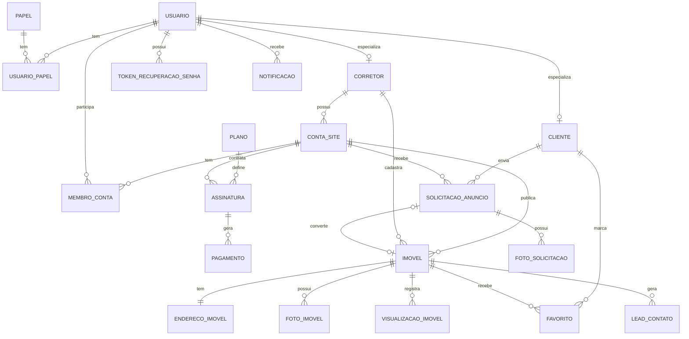
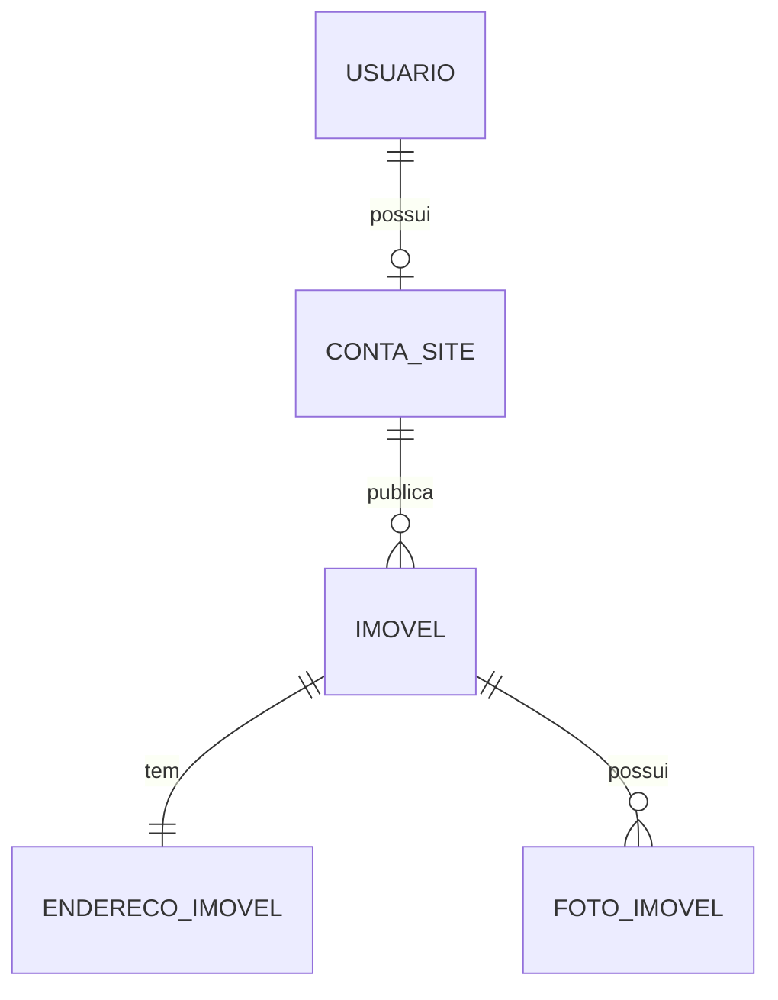

# CAVI

## 1. DER completo — aplicação final

### 1.1 Diagrama de entidades e relacionamentos

### 1.2 Entidades principais

| Entidade | Função no sistema |
| --- | --- |
| **Usuario** | Armazena os dados comuns de qualquer pessoa que usa o sistema: nome, CPF, nascimento, telefone, e-mail, senha e status. |
| **Papel** | Representa os tipos de acesso: administrador, corretor e cliente. |
| **UsuarioPapel** | Permite que um mesmo usuário tenha um ou mais papéis no sistema. |
| **Cliente** | Especialização de usuário para quem favorita imóveis e solicita anúncios. |
| **Corretor** | Especialização de usuário com dados profissionais, principalmente CRECI. |
| **ContaSite** | Representa o site/vitrine de um corretor ou pequena imobiliária. Guarda nome público, slug, domínio, WhatsApp, logo, cores e configurações visuais. |
| **MembroConta** | Permite que uma imobiliária tenha mais de um usuário/corretor vinculado, respeitando os limites dos planos. |
| **Plano** | Guarda os planos Junior, Starter e Pro, com mensalidade, limite de autores, limite de imóveis, armazenamento e domínio próprio. O documento prevê planos recorrentes com diferentes níveis de recursos. |
| **Assinatura** | Registra o plano contratado por uma conta/site, status da assinatura e datas de início, renovação ou cancelamento. |
| **Pagamento** | Registra cobranças, faturas, valor, vencimento, método de pagamento e status. Isso se relaciona à previsão de gateway de pagamentos no projeto. |
| **Imovel** | Entidade central do sistema. Guarda título, descrição, tipo, finalidade, preço, área, quartos, banheiros, vagas, status, destaque, slug e vínculo com corretor/conta. |
| **EnderecoImovel** | Guarda CEP, logradouro, número, bairro, cidade, UF, complemento e, opcionalmente, latitude/longitude. |
| **FotoImovel** | Armazena as fotos do imóvel, ordem de exibição, legenda e indicação de foto principal. |
| **Favorito** | Relaciona clientes e imóveis favoritos. Atende aos requisitos de favoritar e listar favoritos. |
| **SolicitacaoAnuncio** | Permite que um cliente envie a um corretor um pedido para anunciar um imóvel de venda ou aluguel. |
| **FotoSolicitacao** | Fotos enviadas pelo cliente junto com a solicitação de anúncio. |
| **VisualizacaoImovel** | Registra acessos aos imóveis para gerar estatísticas ao corretor. |
| **LeadContato** | Registra interessados que entraram em contato por formulário ou botão de WhatsApp, caso o sistema deseje armazenar esses contatos. |
| **TokenRecuperacaoSenha** | Controla recuperação de senha. |
| **Notificacao** | Registra notificações por e-mail ou SMS, recursos previstos nas integrações do projeto. |

## 2. Páginas web da aplicação completa

### 2.1 Área pública / visitante anônimo

| Página | Descrição |
| --- | --- |
| **Página inicial da CAVI** | Apresenta a plataforma, seus benefícios, diferenciais, chamada para corretores assinarem e uma lista de corretores/imobiliárias cadastrados. Atende ao requisito de mostrar a página principal com corretores e informações de qualidade da aplicação. |
| **Página de planos** | Mostra os planos Junior, Starter e Pro, valores, limites de imóveis, armazenamento, domínio próprio e botão para assinatura. |
| **Cadastro de cliente** | Formulário para visitante se cadastrar como cliente com nome completo, CPF, data de nascimento, telefone, e-mail e senha. |
| **Cadastro de corretor / assinatura** | Formulário para corretor contratar plano, informando nome, CPF, data de nascimento, CRECI, telefone, e-mail e senha. |
| **Login** | Entrada no sistema com e-mail e senha. |
| **Recuperação de senha** | Solicitação de link ou código para redefinir senha. |
| **Redefinição de senha** | Tela acessada por token para cadastrar nova senha. |
| **Termos de uso e privacidade** | Página importante porque o sistema lida com CPF, telefone, e-mail, imóveis e pagamentos. |
| **Página pública do corretor/imobiliária** | Site próprio do corretor, com identidade visual, apresentação, contatos e imóveis em destaque. |
| **Catálogo público de imóveis** | Lista os imóveis de um corretor/imobiliária com filtros por localização, preço, tipo e finalidade. O documento prevê catálogo, busca e filtros de imóveis. |
| **Detalhes do imóvel** | Mostra galeria, preço, descrição, características, localização, dados do corretor, botão de WhatsApp e opção de favoritar quando o usuário estiver logado. |
| **Página 404 / imóvel não encontrado** | Exibida quando o imóvel, corretor ou página não existir mais. |

### 2.2 Área do cliente

| Página | Descrição |
| --- | --- |
| **Painel do cliente** | Página inicial após login, com resumo dos favoritos e solicitações enviadas. |
| **Meus favoritos** | Lista imóveis favoritados pelo cliente. |
| **Solicitar anúncio de imóvel** | Formulário para cliente enviar dados de um imóvel que deseja vender ou alugar por meio de um corretor. |
| **Minhas solicitações de anúncio** | Lista as solicitações enviadas, com status: pendente, aprovada, reprovada ou corrigida. |
| **Detalhes da solicitação** | Mostra os dados enviados, fotos, status e eventual motivo de reprovação. |
| **Corrigir solicitação reprovada** | Permite alterar dados de uma solicitação que o corretor reprovou. |
| **Meu perfil** | Alteração de dados pessoais do cliente. |
| **Alterar senha** | Alteração de senha do cliente autenticado. |

### 2.3 Área do corretor

| Página | Descrição |
| --- | --- |
| **Dashboard do corretor** | Resumo de imóveis cadastrados, imóveis ocultos/publicados, solicitações pendentes, contatos recebidos e acessos recentes. |
| **Meus imóveis** | Lista os imóveis cadastrados pelo corretor, com busca, filtros e ações rápidas. |
| **Cadastrar imóvel** | Formulário para incluir imóvel com título, descrição, finalidade, tipo, preço, endereço, características e fotos. |
| **Editar imóvel** | Permite alterar os dados de um imóvel já cadastrado. |
| **Gerenciar fotos do imóvel** | Permite enviar, remover, ordenar e escolher foto principal. Pode ser incorporada à página de cadastro/edição. |
| **Pré-visualizar imóvel** | Mostra como o imóvel aparecerá para os visitantes antes da publicação. |
| **Ocultar / mostrar imóvel** | Página ou ação para tirar um imóvel do catálogo público sem excluí-lo. |
| **Solicitações de anúncio** | Lista solicitações enviadas por clientes ao corretor. |
| **Detalhes da solicitação recebida** | Mostra os dados do imóvel enviado pelo cliente, fotos e contatos. |
| **Aprovar solicitação** | Converte a solicitação em imóvel cadastrado. |
| **Reprovar solicitação** | Permite informar o motivo da reprovação para que o cliente possa corrigir. |
| **Estatísticas de imóveis** | Mostra acessos, imóveis mais vistos, origem dos acessos e contatos gerados. |
| **Leads / contatos recebidos** | Lista interessados que entraram em contato por formulário ou WhatsApp, caso o contato seja registrado. |
| **Configurações do site** | Permite configurar nome público, slug, domínio, logo, cores, tema claro/escuro e dados de contato. |
| **Meu plano e pagamentos** | Mostra plano contratado, limites, faturas, pagamentos e opção de trocar plano. |
| **Perfil profissional** | Alteração de dados do corretor, CRECI, telefone e apresentação pública. |
| **Alterar senha** | Alteração de senha do corretor. |

### 2.4 Área do administrador

| Página | Descrição |
| --- | --- |
| **Dashboard administrativo** | Estatísticas gerais da plataforma: quantidade de corretores, contas, imóveis, assinaturas, pagamentos e acessos. |
| **Corretores cadastrados** | Lista corretores e imobiliárias cadastrados. |
| **Detalhes do corretor** | Mostra dados pessoais, CRECI, conta/site, plano, imóveis e situação geral. |
| **Contas/sites cadastrados** | Lista os sites criados na plataforma, com status ativo/inativo. |
| **Pagamentos e assinaturas** | Mostra situação de pagamento dos corretores sobre o plano contratado, conforme previsto nos requisitos do administrador. |
| **Gestão de planos** | Cadastro e edição dos planos disponíveis. |
| **Estatísticas de uso da plataforma** | Relatórios de crescimento, acessos, imóveis publicados e contas ativas. |
| **Usuários do sistema** | Consulta geral de clientes, corretores e administradores. |
| **Configurações gerais** | Parâmetros da plataforma, limites, integrações e dados institucionais. |

## 3. Recorte para um MVP bem enxuto, mas usável

O núcleo de valor do CAVI é permitir que um corretor tenha uma vitrine online simples, cadastre imóveis e receba contatos de interessados. Portanto, o MVP deve validar isso antes de implementar clientes autenticados, favoritos, solicitações de anúncio, estatísticas avançadas, pagamentos reais, SMS, PWA e personalização completa.

### 3.1 Funcionalidades que entram no MVP

| Área | Entra no MVP? | Justificativa |
| --- | --- | --- |
| Página inicial da CAVI com lista de corretores | Sim | Ajuda o visitante a encontrar vitrines de corretores. |
| Cadastro/login de corretor | Sim | Necessário para que o corretor use a plataforma sozinho. |
| Área do corretor | Sim | Necessária para gerenciar imóveis. |
| Cadastro, edição e listagem de imóveis | Sim | É a principal função do sistema. |
| Upload de fotos do imóvel | Sim | Imóvel sem foto perde valor para o visitante. |
| Publicar/ocultar imóvel | Sim | Permite controlar o que aparece no site. |
| Site público do corretor | Sim | É a promessa principal: ter uma vitrine própria. |
| Catálogo público com filtros simples | Sim | Visitante precisa localizar imóveis. |
| Detalhes do imóvel | Sim | Página essencial para conversão. |
| Botão de WhatsApp | Sim | Forma simples de contato sem precisar criar módulo de mensagens. |
| Admin mínimo para ver corretores | Sim | Ajuda a acompanhar usuários cadastrados. |

### 3.2 Funcionalidades que ficam fora do MVP

| Funcionalidade | Motivo para adiar |
| --- | --- |
| Cadastro de cliente | Não é necessário para o visitante ver imóveis e chamar no WhatsApp. |
| Favoritos | Exige cliente autenticado e não é essencial para validar a vitrine. |
| Solicitação de anúncio por cliente | Aumenta bastante o fluxo; pode ser substituída inicialmente por contato direto. |
| Correção de solicitação reprovada | Depende da funcionalidade anterior. |
| Gateway de pagamento | Pode começar com plano gratuito/teste ou controle manual. |
| SMS | E-mail/WhatsApp já resolvem a comunicação inicial. |
| Estatísticas avançadas | Pode ser substituída por contador simples ou omitida no início. |
| PWA offline | Diferencial interessante, mas não essencial para validar o produto. |
| Domínio próprio | Pode ficar para planos pagos futuros. |
| Tema claro/escuro automático | Não afeta a validação principal. |
| Gestão completa de planos | Pode haver apenas um plano padrão no MVP. |

### 3.3 Páginas do MVP enxuto

| Página | Descrição |
| --- | --- |
| **Home CAVI** | Apresenta a plataforma e lista corretores/sites cadastrados. |
| **Cadastro/Login de corretor** | Permite criar conta e acessar o painel. |
| **Dashboard simples do corretor** | Mostra atalhos para cadastrar imóvel, ver imóveis e configurar site. |
| **Meus imóveis** | Lista imóveis do corretor com ações de editar, ocultar/mostrar e excluir. |
| **Cadastrar/editar imóvel** | Uma única página reutilizada para criar e alterar imóveis, incluindo fotos. |
| **Configurações do site do corretor** | Nome público, slug, telefone/WhatsApp, logo simples e breve descrição. |
| **Catálogo público do corretor** | Lista imóveis publicados com filtros básicos: finalidade, tipo, bairro e faixa de preço. |
| **Detalhes do imóvel** | Mostra fotos, descrição, preço, características, localização e botão de WhatsApp. |
| **Admin — corretores cadastrados** | Página simples para o administrador acompanhar contas criadas e ativar/desativar corretor. |

## 4. DER do MVP enxuto

### 4.1 Entidades do MVP

| Entidade | Campos essenciais |
| --- | --- |
| **Usuario** | id, nome, CPF, telefone, e-mail, senha, tipo\_usuario, status. No MVP, tipos principais: administrador e corretor. |
| **ContaSite** | id, usuario\_id, nome\_publico, slug, descricao, whatsapp, logo, status. Representa a vitrine pública do corretor. |
| **Imovel** | id, conta\_site\_id, título, slug, descrição, tipo, finalidade, preço, área, quartos, banheiros, vagas, status\_publicacao. |
| **EnderecoImovel** | id, imovel\_id, CEP, logradouro, número, bairro, cidade, UF, complemento. |
| **FotoImovel** | id, imovel\_id, url\_arquivo, ordem, foto\_principal. |

Esse MVP já permite o uso real mínimo: o corretor se cadastra, configura sua vitrine, cadastra imóveis com fotos, publica o catálogo e recebe interessados por WhatsApp. A partir daí, as próximas evoluções naturais seriam: favoritos, cadastro de cliente, solicitações de anúncio, assinatura/pagamento e estatísticas.
