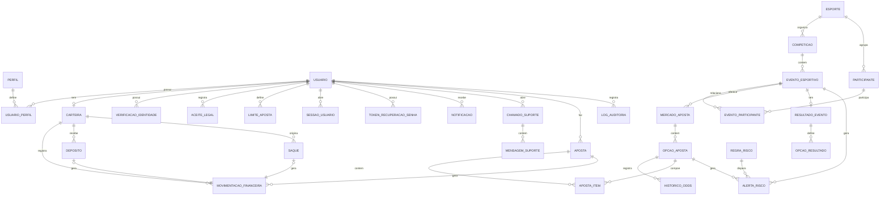
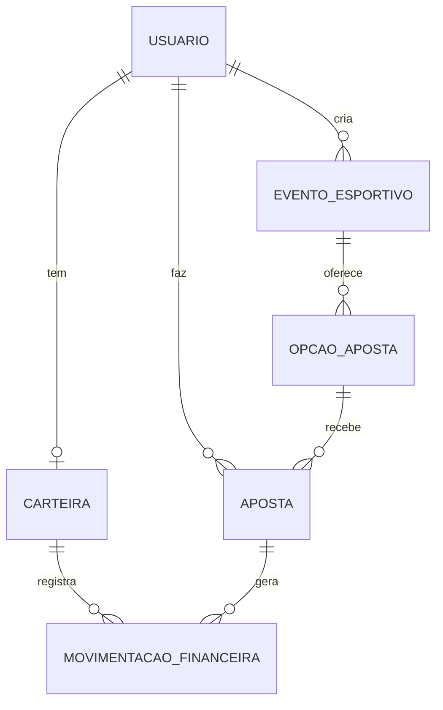

# LanceBet

## 1. DER completo — Lance.BET

### 1.1 Diagrama de entidades e relacionamentos

Legenda:
**1** = um registro.
**N** = vários registros.
**0..1** = opcional.

### 1.2 Entidades principais do sistema completo

| Entidade | Finalidade |
| --- | --- |
| **Usuario** | Armazena dados do apostador ou administrador: nome, CPF, e-mail, senha, data de nascimento, status, data de cadastro e situação de verificação. |
| **Perfil** | Define papéis como `APOSTADOR` e `ADMINISTRADOR`. |
| **UsuarioPerfil** | Permite que um mesmo usuário tenha um ou mais perfis. |
| **VerificacaoIdentidade** | Registra validações de CPF, maioridade, status de aprovação e dados mínimos da verificação. |
| **Carteira** | Guarda o saldo do usuário: saldo real, saldo bloqueado e saldo de teste. |
| **MovimentacaoFinanceira** | Registra todos os créditos e débitos: depósito, saque, aposta, ganho, estorno, taxa operacional e ajuste administrativo. |
| **Deposito** | Controla depósitos via PIX, cartão, boleto ou saldo digital. |
| **Saque** | Controla solicitações de saque, aprovação, rejeição e processamento. |
| **Esporte** | Representa modalidades esportivas, como futebol, basquete, tênis etc. |
| **Competicao** | Representa campeonatos, ligas ou torneios. |
| **Participante** | Representa time, atleta ou competidor. |
| **EventoEsportivo** | Representa uma partida ou evento disponível para aposta. |
| **EventoParticipante** | Relaciona participantes a um evento, permitindo mandante/visitante ou múltiplos competidores. |
| **MercadoAposta** | Representa o tipo de aposta: resultado final, placar, total de gols, vencedor etc. |
| **OpcaoAposta** | Representa cada escolha possível dentro de um mercado, com odd atual e status. |
| **HistoricoOdds** | Registra alterações nas odds, quem alterou, quando e por qual motivo. |
| **Aposta** | Representa o bilhete de aposta do usuário, com valor, odds total, retorno potencial, status e tipo: real ou teste. |
| **ApostaItem** | Guarda cada seleção incluída em uma aposta. Isso permite aposta simples ou múltipla. |
| **ResultadoEvento** | Registra o resultado oficial do evento, validado por administrador. |
| **OpcaoResultado** | Indica quais opções de aposta foram vencedoras ou perdedoras após o resultado. |
| **LimiteAposta** | Guarda limites definidos pelo usuário ou pelo sistema para jogo responsável. |
| **RegraRisco** | Define limites operacionais, como valor máximo por aposta, por evento ou por opção. |
| **AlertaRisco** | Registra concentração de apostas, exposição financeira alta ou situações atípicas. |
| **DocumentoLegal** | Armazena versões de regras, termos de uso, política de privacidade e LGPD. |
| **AceiteLegal** | Registra que o usuário aceitou uma versão específica dos termos. |
| **Notificacao** | Guarda avisos ao usuário, como resultado de evento, aposta liquidada ou saque processado. |
| **ChamadoSuporte** | Representa uma solicitação de atendimento aberta pelo usuário. |
| **MensagemSuporte** | Guarda as mensagens trocadas dentro de um chamado. |
| **SessaoUsuario** | Controla sessões ativas, tokens e encerramento de login. |
| **TokenRecuperacaoSenha** | Guarda tokens temporários para recuperação de senha. |
| **LogAuditoria** | Registra ações críticas: alteração de odds, bloqueio de usuário, aprovação de saque, liquidação de aposta etc. |

## 2. Páginas web necessárias para o aplicativo completo

### 2.1 Área pública

| Página | Descrição |
| --- | --- |
| **Página inicial** | Apresenta a marca Lance.BET, resumo da plataforma, chamada para cadastro/login, aviso de maioridade e destaques de eventos ativos. |
| **Eventos esportivos públicos** | Lista eventos disponíveis, com esporte, competição, data, status e odds resumidas. Usuário anônimo apenas visualiza. |
| **Detalhe público do evento** | Mostra informações do evento, participantes, horário e mercados disponíveis. Para apostar, exige login. |
| **Cadastro** | Formulário com dados pessoais obrigatórios, CPF, e-mail, senha, telefone, data de nascimento, aceite dos termos e validação de maioridade. |
| **Login** | Entrada por CPF/e-mail e senha. Deve direcionar apostador e administrador para áreas diferentes. |
| **Recuperação de senha** | Permite solicitar link ou código de redefinição via e-mail. |
| **Regras da plataforma** | Página estática com regras de uso, funcionamento das apostas, liquidação, cancelamento e responsabilidades. |
| **Política de privacidade e LGPD** | Explica coleta, uso e proteção de dados pessoais. |
| **Jogo responsável / maioridade** | Página com aviso de uso permitido apenas para maiores de 18 anos, limites de aposta e orientações de segurança. |

### 2.2 Área do apostador

| Página | Descrição |
| --- | --- |
| **Dashboard do apostador** | Exibe saldo, eventos em destaque, últimas apostas, notificações e atalhos para depósito, saque e histórico. |
| **Eventos disponíveis** | Lista completa de eventos filtráveis por esporte, competição, data e status. |
| **Detalhe do evento / página de aposta** | Mostra mercados, opções, odds atualizadas, campo de valor da aposta e retorno potencial antes da confirmação. |
| **Boletim de aposta** | Área lateral ou página de revisão antes da confirmação. Exibe seleções, valor total, odds total e possível retorno. |
| **Confirmação de aposta** | Mostra protocolo, data/hora, valor apostado, odds registradas e retorno potencial. |
| **Histórico de apostas reais** | Lista apostas feitas com saldo real, status, evento, valor, odds, retorno potencial e resultado. |
| **Histórico de apostas de teste** | Lista apostas feitas no ambiente de teste, separadas das apostas reais. |
| **Ambiente de teste** | Permite simular apostas sem utilizar saldo real. |
| **Carteira / saldo** | Exibe saldo disponível, saldo bloqueado, saldo de teste e resumo financeiro. |
| **Depósito** | Permite escolher método de pagamento: PIX, cartão ou boleto. Mostra status da transação. |
| **Saque** | Permite solicitar saque, informar dados de recebimento e acompanhar aprovação. |
| **Extrato financeiro** | Mostra todas as movimentações: depósitos, saques, apostas, ganhos, taxas e estornos. |
| **Status de depósitos e saques** | Página específica para acompanhar transações pendentes, aprovadas, rejeitadas ou canceladas. |
| **Perfil do usuário** | Permite visualizar e editar dados permitidos, como telefone e senha. CPF e data de nascimento devem ser bloqueados ou exigir suporte. |
| **Verificação de identidade** | Mostra status da validação de CPF, maioridade e liberação para apostar. |
| **Limites de aposta** | Permite definir limites diários, semanais ou mensais para jogo responsável. |
| **Notificações** | Lista avisos sobre apostas concluídas, resultados, saques e mensagens administrativas. |
| **Suporte** | Permite abrir chamados, enviar mensagens e acompanhar respostas. |

### 2.3 Área administrativa

| Página | Descrição |
| --- | --- |
| **Login administrativo** | Login específico ou fluxo de login comum com redirecionamento para o painel administrativo. |
| **Dashboard administrativo** | Resumo de eventos ativos, volume apostado, usuários cadastrados, saques pendentes, alertas de risco e apostas recentes. |
| **Gerenciar eventos** | Lista eventos cadastrados, com filtros por esporte, competição, status e data. |
| **Cadastrar evento** | Formulário para criar evento esportivo, selecionar esporte, competição, participantes, horário e status inicial. |
| **Editar evento** | Permite alterar informações do evento antes de sua finalização. |
| **Gerenciar mercados** | Permite criar mercados de aposta para cada evento. |
| **Gerenciar odds** | Permite alterar odds, limitar opções, suspender mercados e registrar motivo da alteração. |
| **Histórico de odds** | Mostra todas as alterações de odds, com data, administrador e motivo. |
| **Registrar resultado** | Permite informar resultado oficial do evento, marcar opções vencedoras e iniciar liquidação das apostas. |
| **Encerrar evento** | Fecha evento para novas apostas e define seu status como encerrado, cancelado ou liquidado. |
| **Histórico geral de apostas** | Permite consultar apostas de todos os usuários, com filtros por evento, status, valor e data. |
| **Gerenciar usuários** | Lista usuários, status, verificação, saldo, bloqueios e data de cadastro. |
| **Detalhe do usuário** | Mostra dados cadastrais, histórico de apostas, movimentações, status de verificação e ações administrativas. |
| **Bloquear/liberar usuário** | Permite suspender ou liberar conta de usuário. Pode ser uma ação dentro da página de detalhe do usuário. |
| **Histórico de depósitos** | Lista depósitos realizados, pendentes, aprovados, cancelados ou estornados. |
| **Histórico de saques** | Lista solicitações de saque e seu status. |
| **Gerenciar solicitações de saque** | Permite aprovar, rejeitar ou marcar saque como processado. |
| **Movimentações financeiras da plataforma** | Mostra entradas, saídas, saldo operacional, taxas e pagamentos de prêmios. |
| **Monitoramento de risco** | Exibe concentração de apostas por evento/opção, exposição financeira e alertas de movimentações atípicas. |
| **Logs de auditoria** | Lista ações críticas realizadas por administradores e usuários. |
| **Documentos legais** | Permite cadastrar ou atualizar versões dos termos, regras e política de privacidade. |

### 2.4 Páginas auxiliares

| Página | Descrição |
| --- | --- |
| **Acesso negado** | Mostrada quando o usuário tenta acessar área sem permissão. |
| **Erro 404** | Página para rotas inexistentes. |
| **Erro interno / manutenção** | Página amigável para falhas ou manutenção programada. |
| **Confirmação genérica** | Página reutilizável para confirmar ações como senha alterada, cadastro concluído ou saque solicitado. |

## 3. Recorte para MVP mais enxuto, mas usável

Para o MVP, eu reduziria bastante o escopo, mantendo apenas o fluxo essencial:

1. Usuário se cadastra e faz login.
2. Sistema valida maioridade pela data de nascimento.
3. Usuário recebe saldo fictício inicial.
4. Administrador cadastra eventos e odds manualmente.
5. Apostador visualiza eventos e faz apostas simples.
6. Administrador registra o resultado do evento.
7. Sistema calcula automaticamente vitória/derrota e atualiza o saldo fictício.
8. Usuário consulta histórico de apostas e extrato simples.

### 3.1 Features que entram no MVP

| Feature | Entra? | Justificativa |
| --- | --- | --- |
| Cadastro de usuário | Sim | Necessário para identificar o apostador. |
| Login/logout | Sim | Necessário para separar usuário anônimo, apostador e administrador. |
| Validação de maioridade por data de nascimento | Sim | Essencial ao tema do projeto. |
| Verificação real via API de CPF | Não | Integração externa complexa para MVP. |
| Saldo fictício inicial | Sim | Permite demonstrar apostas sem dinheiro real. |
| Depósito real via MercadoPago | Não | Alta complexidade técnica, financeira e regulatória. |
| Saque real | Não | Também depende de integração, risco e controle financeiro real. |
| Listagem de eventos | Sim | Núcleo do sistema. |
| Cadastro de eventos pelo admin | Sim | Necessário para alimentar a plataforma. |
| Odds manuais | Sim | Mais simples que cálculo dinâmico. |
| Aposta simples | Sim | Principal fluxo do produto. |
| Aposta múltipla | Não | Pode ficar para versão futura. |
| Cash out | Não | Complexo e não essencial. |
| Histórico de apostas | Sim | Necessário para o usuário acompanhar suas ações. |
| Extrato simples | Sim | Ajuda a explicar alterações de saldo. |
| Registro de resultado pelo admin | Sim | Necessário para liquidar apostas. |
| Liquidação automática de apostas | Sim | Essencial para o produto ser usável. |
| Ambiente de teste separado | Não | O MVP inteiro já funciona como ambiente de teste. |
| Notificações | Não | Pode ser substituído por mensagens na interface. |
| Suporte | Não | Não é essencial ao ciclo principal. |
| Relatórios avançados de risco | Não | Pode ser substituído por consultas simples no admin. |
| Logs completos de auditoria | Não | Importante no produto real, mas dispensável no MVP acadêmico. |
| Páginas de regras/LGPD | Sim, simples | Podem ser páginas estáticas. |

## 4. DER do MVP enxuto

### 4.1 Diagrama de entidades e relacionamentos do MVP

> Observação: o relacionamento `USUARIO ||--o{ EVENTO_ESPORTIVO` aplica-se apenas quando o usuário é administrador criador do evento.

### 4.2 Entidades do MVP

| Entidade | Campos essenciais |
| --- | --- |
| **Usuario** | id, nome, CPF, e-mail, senha, data de nascimento, perfil, status, criado\_em. |
| **Carteira** | id, usuario\_id, saldo\_ficticio, atualizado\_em. |
| **MovimentacaoFinanceira** | id, carteira\_id, aposta\_id opcional, tipo, valor, saldo\_apos, descricao, criado\_em. |
| **EventoEsportivo** | id, titulo, esporte, competicao, data\_hora, status, resultado\_descricao, criado\_por. |
| **OpcaoAposta** | id, evento\_id, descricao, odd, status, vencedora. |
| **Aposta** | id, usuario\_id, opcao\_aposta\_id, valor\_apostado, odd\_registrada, retorno\_potencial, status, resultado, criada\_em, liquidada\_em. |

Esse DER é suficiente para demonstrar o produto: cadastro, saldo, eventos, odds, aposta, histórico, resultado e liquidação.

## 5. Páginas do MVP

| Página | Perfil | Descrição |
| --- | --- | --- |
| **Home pública** | Anônimo | Apresenta a plataforma, aviso 18+, links para regras, LGPD, login e cadastro. |
| **Login/Cadastro** | Anônimo | Pode ser uma única página com abas. Cadastro valida maioridade pela data de nascimento. |
| **Dashboard do apostador** | Apostador | Mostra saldo fictício, eventos abertos e últimas apostas. |
| **Detalhe do evento / apostar** | Apostador | Mostra opções de aposta, odds, campo de valor, retorno potencial e botão de confirmar. |
| **Minhas apostas** | Apostador | Lista apostas feitas, status, valor, odd, retorno e resultado. |
| **Carteira / extrato simples** | Apostador | Mostra saldo fictício e movimentações: crédito inicial, apostas, ganhos e estornos. |
| **Regras e LGPD** | Todos | Página estática simples com regras básicas, privacidade e aviso de maioridade. |
| **Admin dashboard** | Administrador | Mostra eventos cadastrados, apostas recentes e usuários. |
| **Admin eventos** | Administrador | Permite cadastrar, editar, abrir, fechar e encerrar eventos. |
| **Admin odds/opções** | Administrador | Permite cadastrar opções de aposta e definir odds manualmente. |
| **Admin resultado/liquidação** | Administrador | Permite marcar opção vencedora e liquidar apostas automaticamente. |
| **Admin usuários/apostas** | Administrador | Consulta usuários, saldos e histórico de apostas. |

## 6. Resumo do MVP recomendado

O MVP mais enxuto e ainda usável seria uma **plataforma simulada de apostas esportivas com saldo fictício**, contendo apenas:

**Apostador:** cadastro, login, saldo fictício, eventos, aposta simples, histórico e extrato.
**Administrador:** cadastro de eventos, definição de odds, registro de resultado e consulta básica de usuários/apostas.
**Fora do MVP:** dinheiro real, MercadoPago, saques, API de CPF, recuperação por e-mail, cash out, aposta múltipla, notificações, suporte e relatórios avançados.

Esse recorte permite apresentar um sistema funcional de ponta a ponta, mas reduz drasticamente a complexidade técnica, financeira e legal.
