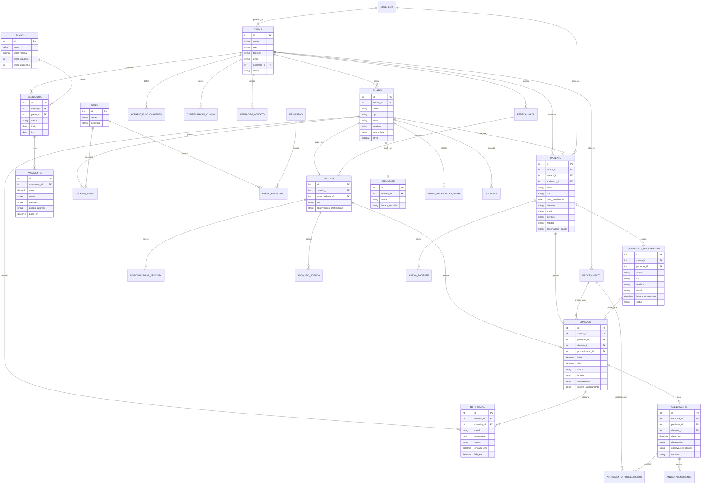
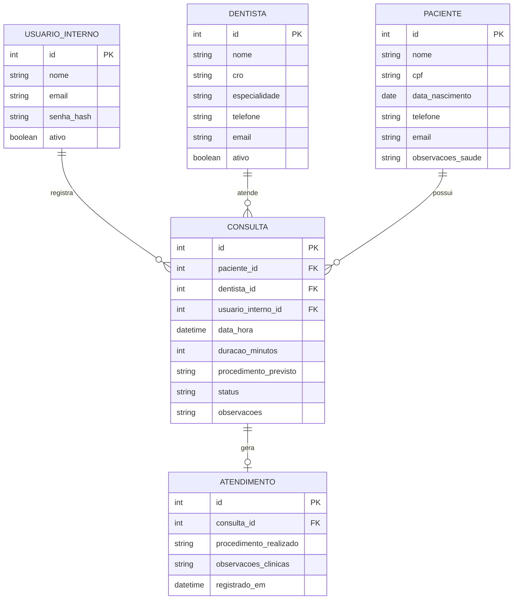

# OdontoX

## 1\. Diagrama de Entidades e Relacionamentos — DER

### Leitura do DER

A entidade central é **Clínica**, pois o sistema pode funcionar como SaaS e atender várias clínicas. Cada clínica possui usuários, pacientes, dentistas, atendentes, procedimentos, horários de funcionamento, configurações, agenda e assinatura.

A entidade **Usuário** representa quem acessa o sistema. O papel real do usuário é definido por **Perfil**, permitindo administrador, dentista, atendente e paciente. Isso atende à exigência de autenticação e autorização por papéis prevista no documento.

OdontoX

**Dentista**, **Atendente** e **Paciente** aparecem como especializações ligadas a Usuário. Isso evita duplicação de login, senha e e-mail, mas permite guardar dados específicos de cada tipo de pessoa.

A agenda é formada por quatro partes: **DisponibilidadeDentista**, **BloqueioAgenda**, **SolicitaçãoAgendamento** e **Consulta**. A disponibilidade informa quando o dentista atende; o bloqueio impede marcações em períodos específicos; a solicitação representa um pedido ainda não confirmado; e a consulta representa o agendamento efetivado.

O prontuário/histórico clínico é representado por **Atendimento**, vinculado a uma consulta. Nele ficam diagnóstico, observações, conduta e procedimentos realizados. O PDF prevê histórico clínico, registros de atendimento e informações de saúde dos pacientes.

OdontoX

As entidades **Plano**, **Assinatura** e **Pagamento** existem porque o documento propõe modelo SaaS com planos e integração com Mercado Pago. Elas não são essenciais para o funcionamento clínico, mas fazem parte de uma versão comercial completa.

OdontoX

---

## 2. Páginas web necessárias para o aplicativo completo

Abaixo trato “página” como **tela lógica**. Na implementação real, algumas podem ser a mesma página com abas, modal ou componentes reutilizados.

---

### 2.1 Páginas públicas e autenticação

| Página | Descrição |
| --- | --- |
| Página inicial / Landing page | Apresenta o OdontoX, benefícios, chamada para login, cadastro, solicitação de agendamento e planos. |
| Sobre a clínica / Institucional | Mostra história, missão, equipe, localização e informações públicas da clínica. |
| Serviços e especialidades | Lista serviços odontológicos oferecidos, especialidades, descrição dos procedimentos e possível duração média. |
| Equipe profissional | Exibe dentistas, especialidades, registros profissionais e horários gerais de atendimento. |
| Localização e contato | Mostra endereço, telefone, e-mail, mapa e formulário de contato. |
| Solicitação pública de agendamento | Permite que usuário anônimo informe nome, CPF, telefone, e-mail, serviço desejado e horário preferencial. |
| Login | Autenticação por e-mail e senha. |
| Cadastro de paciente | Permite que um paciente crie conta própria, informando dados pessoais, contato, endereço e senha. |
| Recuperação de senha | Tela para informar e-mail ou CPF e solicitar redefinição de senha. |
| Redefinição de senha | Tela acessada por link/token para criação de nova senha. |
| Planos e preços | Apresenta planos Free, Starter e Pro, limites de usuários/pacientes e chamada para contratação. |
| Termos de uso e privacidade | Página obrigatória para esclarecer uso dos dados, especialmente por envolver informações sensíveis de saúde. |

O documento prevê acesso anônimo à página inicial, login, cadastro, redefinição de senha, página institucional, contato e solicitação de agendamento.

OdontoX

---

### 2.2 Páginas de onboarding SaaS

| Página | Descrição |
| --- | --- |
| Cadastro da clínica | Criação da conta da clínica, com nome, CNPJ/CPF, endereço, telefone, e-mail e dados do responsável. |
| Cadastro do primeiro administrador | Criação do usuário responsável pela clínica. |
| Escolha de plano | Seleção entre Free, Starter e Pro. |
| Checkout / Pagamento | Integração com Mercado Pago para contratação ou renovação do plano. |
| Confirmação da assinatura | Confirma status do pagamento, plano contratado e libera acesso à área administrativa. |
| Dados de cobrança | Permite visualizar e alterar informações de cobrança da clínica. |
| Histórico de pagamentos | Lista mensalidades, status, valores, vencimentos e comprovantes. |

---

### 2.3 Páginas do administrador da clínica

Os requisitos do administrador incluem dashboard, gerenciamento de usuários, dentistas, atendentes, pacientes, agenda, consultas, atendimentos, configurações da clínica e perfis de acesso.

OdontoX

| Página | Descrição |
| --- | --- |
| Dashboard geral da clínica | Exibe indicadores: pacientes cadastrados, consultas do dia, consultas realizadas, cancelamentos, faltas e filtros por período/profissional. |
| Agenda geral | Calendário com todos os dentistas, horários disponíveis, consultas marcadas, bloqueios e status dos atendimentos. |
| Nova consulta | Formulário para vincular paciente, dentista, procedimento, data, horário e observações. |
| Editar consulta | Permite remarcar, cancelar, confirmar presença, alterar status e registrar motivo de alteração. |
| Detalhes da consulta | Mostra paciente, dentista, procedimento, histórico de alterações, status e notificações enviadas. |
| Solicitações de agendamento | Lista pedidos feitos por pacientes ou usuários anônimos, permitindo aprovar, rejeitar ou transformar em consulta. |
| Pacientes — listagem | Busca por nome, CPF, telefone e filtros. Mostra pacientes cadastrados. |
| Paciente — cadastro/edição | Formulário completo com dados pessoais, endereço, contato, alergias, hábitos e informações de saúde. |
| Paciente — detalhes | Exibe dados cadastrais, próximas consultas, histórico, anexos e resumo clínico. |
| Dentistas — listagem | Lista profissionais vinculados à clínica. |
| Dentista — cadastro/edição | Formulário com nome, CPF, telefone, e-mail, CRO, especialidade e dados profissionais. |
| Horários do dentista | Define disponibilidade semanal, intervalos e horários de atendimento. |
| Bloqueios de agenda | Cadastra férias, indisponibilidades, feriados ou bloqueios pontuais. |
| Atendentes — listagem | Lista atendentes da clínica. |
| Atendente — cadastro/edição | Formulário com dados pessoais, função, e-mail, telefone e horário de trabalho. |
| Usuários e acessos | Gerencia contas ativas/inativas, redefinição de senha e vínculo com perfis. |
| Perfis e permissões | Cria perfis personalizados e define permissões por funcionalidade. |
| Serviços/procedimentos | Cadastro de tipos de atendimento, duração prevista e valor de referência. |
| Especialidades | Cadastro de especialidades odontológicas. |
| Atendimentos realizados | Lista atendimentos concluídos, com filtros por paciente, dentista, período e procedimento. |
| Relatórios | Indicadores de produtividade, cancelamentos, faltas, pacientes atendidos e consultas por período. |
| Notificações e lembretes | Configura e acompanha envio de lembretes por e-mail, SMS, WhatsApp ou sistema. |
| Configurações da clínica | Horário de funcionamento, política de cancelamento, intervalo entre consultas e regras gerais. |
| Assinatura e pagamentos | Plano atual, limites, vencimentos, faturas e alteração de plano. |
| Auditoria | Lista ações críticas realizadas no sistema: criação, alteração, exclusão, cancelamento e login. |
| Meu perfil | Permite que o administrador atualize seus próprios dados. |

---

### 2.4 Páginas do dentista

Os requisitos do dentista incluem dashboard pessoal, agenda, pacientes vinculados, histórico de atendimentos, registro de atendimento, confirmação de consulta e notificações.

OdontoX

| Página | Descrição |
| --- | --- |
| Dashboard do dentista | Mostra resumo do dia, próximas consultas, notificações e status dos atendimentos. |
| Minha agenda | Calendário apenas com consultas do dentista logado. |
| Detalhes da consulta | Exibe paciente, horário, procedimento, observações e ações permitidas. |
| Meus pacientes | Lista pacientes atendidos ou vinculados ao dentista. |
| Detalhes do paciente | Exibe dados básicos, histórico clínico, consultas anteriores e observações. |
| Registrar atendimento | Tela para preencher diagnóstico, procedimentos realizados, evolução clínica e observações. |
| Histórico de atendimentos | Lista atendimentos já realizados pelo dentista, com filtros por paciente e período. |
| Notificações | Mostra mudanças na agenda, consultas próximas e comunicados internos. |
| Meu perfil profissional | Permite atualizar telefone, e-mail, preferências e informações profissionais. |

---

### 2.5 Páginas do atendente

Os requisitos do atendente incluem dashboard operacional, agenda completa, cadastro e atualização de pacientes, agendamento, remarcação, cancelamento, presença, status da consulta, envio de lembretes e busca rápida de pacientes.

OdontoX

| Página | Descrição |
| --- | --- |
| Dashboard operacional | Mostra agenda do dia, consultas pendentes, atrasos, confirmações e pacientes aguardando. |
| Agenda da clínica | Visualização completa da agenda de todos os dentistas. |
| Agendar consulta | Tela para localizar paciente, escolher dentista, horário disponível e procedimento. |
| Editar/remarcar consulta | Permite alterar horário, dentista, procedimento ou observações. |
| Cancelar consulta | Registra cancelamento e motivo. |
| Registrar presença | Marca paciente como presente, ausente ou aguardando atendimento. |
| Solicitações de agendamento | Modera pedidos feitos pelo site ou pela área do paciente. |
| Pacientes — busca/listagem | Busca rápida por nome, CPF ou telefone. |
| Paciente — cadastro/edição | Cadastro e atualização dos dados pessoais e de saúde do paciente. |
| Paciente — detalhes resumidos | Mostra informações essenciais para atendimento administrativo. |
| Horários livres | Consulta disponibilidade dos dentistas para novos agendamentos. |
| Lembretes | Envio ou reenvio de lembretes de consulta. |
| Notificações internas | Comunicados sobre alterações de agenda e pendências. |

---

### 2.6 Páginas do paciente

Os requisitos do paciente incluem área pessoal, consultas agendadas, histórico, solicitação/agendamento, remarcação/cancelamento, atualização cadastral, notificações e confirmação de presença.

OdontoX

| Página | Descrição |
| --- | --- |
| Área do paciente | Resumo com próximas consultas, notificações e atalhos principais. |
| Minhas consultas | Lista consultas futuras e passadas. |
| Detalhes da consulta | Mostra data, horário, dentista, procedimento, status e observações. |
| Solicitar/agendar consulta | Permite escolher serviço, informar preferência de horário e enviar solicitação. |
| Remarcar consulta | Permite solicitar nova data/horário conforme regras da clínica. |
| Cancelar consulta | Permite cancelamento respeitando política definida pela clínica. |
| Confirmar presença | Botão para confirmar comparecimento. |
| Histórico de atendimentos | Exibe consultas já realizadas e informações liberadas ao paciente. |
| Meus dados | Visualização e atualização de endereço, telefone, e-mail e contatos. |
| Notificações | Lembretes, confirmações, cancelamentos e mensagens da clínica. |

---

### 2.7 Backoffice da plataforma OdontoX

Essas páginas não são da clínica, mas da empresa dona do SaaS.

| Página | Descrição |
| --- | --- |
| Dashboard da plataforma | Indicadores globais: clínicas ativas, assinaturas, receita, inadimplência e uso. |
| Clínicas cadastradas | Lista e gerencia clínicas clientes. |
| Detalhes da clínica | Mostra plano, usuários, pacientes, status da assinatura e dados de contato. |
| Planos | Cadastro e edição de planos Free, Starter e Pro. |
| Assinaturas | Controle de assinaturas ativas, suspensas, canceladas ou em teste. |
| Pagamentos | Consulta transações do Mercado Pago, faturas e status. |
| Suporte | Mensagens recebidas, chamados e solicitações das clínicas. |
| Logs gerais | Auditoria técnica e operacional da plataforma. |

---

## 3\. MVP mais enxuto: “Agenda Clínica Interna”

Neste recorte, **somente a equipe da clínica acessa o sistema**. O paciente não tem login, não agenda sozinho e não recebe notificações automáticas pelo sistema nessa primeira versão.

A clínica usa o OdontoX para substituir agenda física, planilha ou controle manual.

---

### 3.1\. Perfis do MVP reduzido

#### Manter apenas um perfil

| Perfil | Entra? | Observação |
| --- | --- | --- |
| Usuário interno | Sim | Pode representar administrador, atendente ou o próprio dentista. |
| Dentista com login próprio | Não | Dentista será apenas cadastrado como profissional da agenda. |
| Atendente com perfil separado | Não | O usuário interno já faz essa função. |
| Paciente com login | Não | O paciente será apenas cadastrado pela clínica. |
| Usuário anônimo | Não | Sem formulário público de agendamento no MVP. |

Essa redução elimina boa parte da complexidade de autorização por perfil, área do paciente, área do dentista, notificações e telas públicas.

---

### 3.2\. Páginas mínimas do MVP

#### Página 1 — Login

Tela simples para o usuário interno entrar no sistema.

Deve conter:

| Elemento | Descrição |
| --- | --- |
| E-mail | Identificação do usuário interno. |
| Senha | Senha de acesso. |
| Entrar | Acesso ao sistema. |

Neste MVP, nem precisa ter cadastro público. O primeiro usuário pode ser criado previamente no banco ou por uma tela administrativa simples.

---

#### Página 2 — Agenda

Essa é a página principal do sistema.

Deve permitir:

| Função | Descrição |
| --- | --- |
| Ver consultas do dia | Lista ou calendário com consultas agendadas. |
| Filtrar por data | Escolher o dia que deseja visualizar. |
| Filtrar por dentista | Ver a agenda de um profissional específico. |
| Criar consulta | Agendar um novo atendimento. |
| Editar consulta | Alterar data, horário, paciente, dentista ou observação. |
| Cancelar consulta | Marcar como cancelada. |
| Marcar como atendida | Indicar que o atendimento ocorreu. |
| Marcar ausência | Registrar que o paciente faltou. |

Essa página sozinha já entrega o principal valor do sistema: **controle da agenda odontológica**, que é um dos objetivos centrais descritos no projeto.

OdontoX

---

#### Página 3 — Pacientes

Página para listar e cadastrar pacientes.

Deve conter:

| Função | Descrição |
| --- | --- |
| Listar pacientes | Tabela com nome, CPF, telefone e e-mail. |
| Buscar paciente | Busca por nome, CPF ou telefone. |
| Cadastrar paciente | Formulário com dados básicos. |
| Editar paciente | Atualizar dados cadastrais. |
| Ver histórico | Exibir consultas e atendimentos anteriores. |

Campos mínimos do paciente:

| Campo |
| --- |
| Nome |
| CPF |
| Data de nascimento |
| Telefone |
| E-mail |
| Observações de saúde |

Não colocaria endereço completo, CEP automático, anexos, alergias detalhadas e hábitos no MVP reduzido. Esses campos podem entrar depois.

---

#### Página 4 — Dentistas

Página simples para cadastrar os profissionais que aparecem na agenda.

Deve conter:

| Função | Descrição |
| --- | --- |
| Listar dentistas | Exibir profissionais cadastrados. |
| Cadastrar dentista | Nome, telefone, e-mail e especialidade. |
| Editar dentista | Atualizar dados. |
| Ativar/desativar | Remover da agenda sem apagar histórico. |

Campos mínimos:

| Campo |
| --- |
| Nome |
| CRO, se quiser manter dado profissional |
| Especialidade |
| Telefone |
| E-mail |
| Ativo/Inativo |

Não criaria login para dentista neste momento.

---

#### Página 5 — Atendimento / Histórico

Essa página pode ser acessada a partir de uma consulta marcada como atendida.

Deve permitir:

| Função | Descrição |
| --- | --- |
| Registrar atendimento | Informar o que foi feito na consulta. |
| Registrar observações | Campo livre para anotações clínicas. |
| Ver atendimentos anteriores | Histórico simples do paciente. |

Campos mínimos:

| Campo |
| --- |
| Paciente |
| Dentista |
| Data |
| Procedimento realizado |
| Observações do atendimento |

O documento prevê que o sistema armazene histórico clínico e registros de atendimento dos pacientes, então essa parte é importante mesmo no MVP enxuto.

OdontoX

---

### 3.3\. Entidades mínimas do MVP reduzido

Esse DER reduzido é suficiente para uma clínica usar o sistema no dia a dia.

---

### 3.4\. O que sai do MVP reduzido

| Item removido | Motivo |
| --- | --- |
| Área do paciente | Exige cadastro, login, permissões, recuperação de senha e telas extras. |
| Área do dentista | O usuário interno já pode consultar e registrar atendimentos. |
| Solicitação pública de agendamento | Pode ser feita por telefone/WhatsApp fora do sistema no início. |
| Notificações automáticas | Pode ficar manual no começo. |
| WhatsApp, SMS e e-mail automático | Integração aumenta complexidade. |
| Mercado Pago | Não é necessário para validar o uso operacional. |
| Planos SaaS | O MVP pode funcionar para uma clínica apenas. |
| Multi-clínicas | Começar com uma clínica reduz drasticamente o modelo de dados. |
| Perfis personalizados | Um único perfil interno já resolve. |
| Disponibilidade detalhada do dentista | No início, basta impedir conflito de horário na agenda. |
| Bloqueios de agenda | Pode ser representado como uma “consulta” do tipo bloqueio, se necessário. |
| Dashboard com indicadores | A agenda do dia já serve como tela inicial. |
| Relatórios | Não são essenciais para o primeiro uso. |
| Anexos de exames | Úteis, mas não necessários para agenda e histórico básico. |

---

### 3.5\. Fluxo de uso do MVP reduzido

1. Usuário interno faz login.

2. Cadastra dentistas.

3. Cadastra pacientes.

4. Abre a agenda.

5. Agenda consulta para paciente e dentista.

6. No dia da consulta, marca como atendida, cancelada ou ausente.

7. Se atendida, registra o atendimento.

8. Depois, consegue consultar o histórico do paciente.

Esse fluxo já resolve o problema central de organização de agenda, pacientes e atendimentos, que aparece como a proposta principal do OdontoX.

---

### 3.6\. Recorte final recomendado

Eu deixaria o MVP assim:

| Prioridade | Página/feature |
| --- | --- |
| 1 | Login |
| 2 | Agenda |
| 3 | Cadastro/listagem de pacientes |
| 4 | Cadastro/listagem de dentistas |
| 5 | Registro de atendimento/histórico do paciente |

Em uma frase: **o MVP mais enxuto do OdontoX é uma agenda interna para clínica odontológica, com cadastro de pacientes, cadastro de dentistas, marcação de consultas e registro básico de atendimentos**.