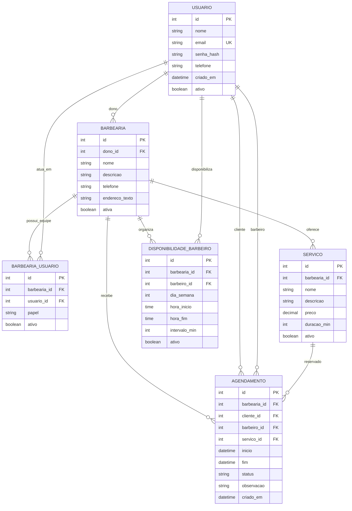

# VouDeBarba

## 1\. DER completo do VouDeBarba

```mermaid
erDiagram  
    USUARIO {  
        int id PK  
        string nome  
        string email UK  
        string senha_hash  
        string telefone  
        string foto_url  
        boolean ativo  
        datetime criado_em  
    }  
  
    PERFIL {  
        int id PK  
        string nome  
    }  
  
    USUARIO_PERFIL {  
        int usuario_id FK  
        int perfil_id FK  
    }  
  
    ENDERECO {  
        int id PK  
        string cep  
        string logradouro  
        string numero  
        string complemento  
        string bairro  
        string cidade  
        string estado  
        decimal latitude  
        decimal longitude  
    }  
  
    BARBEARIA {  
        int id PK  
        int responsavel_id FK  
        int endereco_id FK  
        string nome  
        string descricao  
        string telefone  
        string email  
        string status  
        datetime criado_em  
    }  
  
    PLANO {  
        int id PK  
        string nome  
        decimal preco_mensal  
        int limite_agendamentos  
        boolean modulo_financeiro  
        boolean dashboard  
    }  
  
    ASSINATURA {  
        int id PK  
        int barbearia_id FK  
        int plano_id FK  
        string status  
        date inicio  
        date fim  
        string referencia_pagamento  
    }  
  
    BARBEARIA_USUARIO {  
        int id PK  
        int barbearia_id FK  
        int usuario_id FK  
        string papel  
        decimal percentual_comissao  
        boolean ativo  
    }  
  
    HORARIO_FUNCIONAMENTO {  
        int id PK  
        int barbearia_id FK  
        int dia_semana  
        time hora_abertura  
        time hora_fechamento  
        boolean ativo  
    }  
  
    REGRA_OPERACIONAL {  
        int id PK  
        int barbearia_id FK  
        int antecedencia_minima_min  
        int prazo_cancelamento_horas  
        int intervalo_padrao_min  
        boolean exige_confirmacao  
    }  
  
    SERVICO {  
        int id PK  
        int barbearia_id FK  
        string nome  
        string descricao  
        decimal preco  
        int duracao_min  
        boolean ativo  
    }  
  
    BARBEIRO_SERVICO {  
        int id PK  
        int barbeiro_id FK  
        int servico_id FK  
        decimal preco_especifico  
        int duracao_especifica_min  
        boolean ativo  
    }  
  
    DISPONIBILIDADE_BARBEIRO {  
        int id PK  
        int barbearia_id FK  
        int barbeiro_id FK  
        int dia_semana  
        time hora_inicio  
        time hora_fim  
        int intervalo_min  
        boolean ativo  
    }  
  
    BLOQUEIO_AGENDA {  
        int id PK  
        int barbearia_id FK  
        int barbeiro_id FK  
        datetime inicio  
        datetime fim  
        string motivo  
    }  
  
    AGENDAMENTO {  
        int id PK  
        int barbearia_id FK  
        int cliente_id FK  
        int barbeiro_id FK  
        int servico_id FK  
        datetime inicio  
        datetime fim  
        string status  
        decimal valor  
        string observacao  
        datetime criado_em  
    }  
  
    HISTORICO_AGENDAMENTO {  
        int id PK  
        int agendamento_id FK  
        int usuario_id FK  
        string acao  
        datetime criado_em  
    }  
  
    PAGAMENTO {  
        int id PK  
        int agendamento_id FK  
        decimal valor  
        string metodo  
        string status  
        string transacao_externa_id  
        datetime pago_em  
    }  
  
    COMISSAO {  
        int id PK  
        int agendamento_id FK  
        int barbeiro_id FK  
        decimal percentual  
        decimal valor  
        string status  
    }  
  
    CONTA_FINANCEIRA {  
        int id PK  
        int barbearia_id FK  
        int agendamento_id FK  
        string tipo  
        string descricao  
        decimal valor  
        date vencimento  
        string status  
    }  
  
    CONVERSA_CHAT {  
        int id PK  
        int barbearia_id FK  
        int cliente_id FK  
        string status  
        datetime criado_em  
    }  
  
    MENSAGEM_CHAT {  
        int id PK  
        int conversa_id FK  
        int remetente_id FK  
        string conteudo  
        boolean lida  
        datetime enviada_em  
    }  
  
    NOTIFICACAO_EMAIL {  
        int id PK  
        int usuario_id FK  
        int agendamento_id FK  
        string tipo  
        string status  
        datetime enviada_em  
    }  
  
    MIDIA {  
        int id PK  
        int barbearia_id FK  
        int usuario_id FK  
        int servico_id FK  
        string url  
        string tipo  
        int ordem  
    }  
  
    TOKEN_RECUPERACAO {  
        int id PK  
        int usuario_id FK  
        string token_hash  
        datetime expira_em  
        boolean usado  
    }  
  
    CHAMADO_SUPORTE {  
        int id PK  
        int usuario_id FK  
        string assunto  
        string status  
        datetime criado_em  
    }  
  
    INTERACAO_CHAMADO {  
        int id PK  
        int chamado_id FK  
        int usuario_id FK  
        string mensagem  
        datetime criado_em  
    }  
  
    VERIFICACAO_CONTA {  
        int id PK  
        int usuario_id FK  
        int barbearia_id FK  
        string status  
        string documento_url  
        datetime criado_em  
    }  
  
    LOG_OPERACAO {  
        int id PK  
        int usuario_id FK  
        string entidade  
        string acao  
        string ip  
        datetime criado_em  
    }  
  
    USUARIO ||--o{ USUARIO_PERFIL : possui  
    PERFIL ||--o{ USUARIO_PERFIL : classifica  
  
    USUARIO ||--o{ BARBEARIA : responsavel  
    ENDERECO ||--o{ BARBEARIA : localiza  
  
    BARBEARIA ||--o{ ASSINATURA : contrata  
    PLANO ||--o{ ASSINATURA : define  
  
    BARBEARIA ||--o{ BARBEARIA_USUARIO : possui_equipe  
    USUARIO ||--o{ BARBEARIA_USUARIO : participa  
  
    BARBEARIA ||--o{ HORARIO_FUNCIONAMENTO : define  
    BARBEARIA ||--o{ REGRA_OPERACIONAL : configura  
    BARBEARIA ||--o{ SERVICO : oferece  
  
    USUARIO ||--o{ BARBEIRO_SERVICO : executa  
    SERVICO ||--o{ BARBEIRO_SERVICO : atribui  
  
    BARBEARIA ||--o{ DISPONIBILIDADE_BARBEIRO : organiza  
    USUARIO ||--o{ DISPONIBILIDADE_BARBEIRO : disponibiliza  
  
    BARBEARIA ||--o{ BLOQUEIO_AGENDA : possui  
    USUARIO ||--o{ BLOQUEIO_AGENDA : bloqueia  
  
    BARBEARIA ||--o{ AGENDAMENTO : recebe  
    USUARIO ||--o{ AGENDAMENTO : cliente  
    USUARIO ||--o{ AGENDAMENTO : barbeiro  
    SERVICO ||--o{ AGENDAMENTO : reservado  
  
    AGENDAMENTO ||--o{ HISTORICO_AGENDAMENTO : registra  
    USUARIO ||--o{ HISTORICO_AGENDAMENTO : altera  
  
    AGENDAMENTO ||--o{ PAGAMENTO : possui  
    AGENDAMENTO ||--o{ COMISSAO : gera  
    USUARIO ||--o{ COMISSAO : recebe  
  
    BARBEARIA ||--o{ CONTA_FINANCEIRA : controla  
    AGENDAMENTO ||--o{ CONTA_FINANCEIRA : origina  
  
    BARBEARIA ||--o{ CONVERSA_CHAT : atende  
    USUARIO ||--o{ CONVERSA_CHAT : inicia  
    CONVERSA_CHAT ||--o{ MENSAGEM_CHAT : contem  
    USUARIO ||--o{ MENSAGEM_CHAT : envia  
  
    USUARIO ||--o{ NOTIFICACAO_EMAIL : recebe  
    AGENDAMENTO ||--o{ NOTIFICACAO_EMAIL : dispara  
  
    BARBEARIA ||--o{ MIDIA : possui  
    USUARIO ||--o{ MIDIA : possui  
    SERVICO ||--o{ MIDIA : possui  
  
    USUARIO ||--o{ TOKEN_RECUPERACAO : solicita  
    USUARIO ||--o{ CHAMADO_SUPORTE : abre  
    CHAMADO_SUPORTE ||--o{ INTERACAO_CHAMADO : possui  
    USUARIO ||--o{ INTERACAO_CHAMADO : escreve  
  
    USUARIO ||--o{ VERIFICACAO_CONTA : solicita  
    BARBEARIA ||--o{ VERIFICACAO_CONTA : verifica  
  
    USUARIO ||--o{ LOG_OPERACAO : realiza
```

## 2\. Páginas web necessárias para o aplicativo completo

### Páginas públicas e autenticação

| Página | Descrição |
| --- | --- |
| **Home / Landing Page** | Apresenta o VouDeBarba, benefícios para clientes e barbearias, chamadas para cadastro, login e busca de barbearias. |
| **Busca de barbearias** | Lista barbearias cadastradas, com filtros por nome, cidade, serviço e proximidade. Pode exibir mapa com localização. |
| **Detalhes da barbearia** | Mostra dados da barbearia, endereço, mapa, fotos, barbeiros, serviços, preços, duração e botão para agendar. |
| **Simulação de agendamento** | Permite ao usuário anônimo escolher serviço, barbeiro, data e horário, sem confirmar o agendamento. |
| **Revisão do agendamento** | Mostra resumo do serviço, barbeiro, data, horário, preço e exige login/cadastro para confirmar. |
| **Pagamento / checkout** | Quando habilitado, permite pagamento antecipado via PIX ou cartão, usando Mercado Pago. |
| **Confirmação do agendamento** | Exibe o agendamento confirmado, status do pagamento, orientações e opção de adicionar à agenda pessoal. |
| **Cadastro de usuário** | Formulário com nome, e-mail, telefone e senha. Valida e-mail único e telefone. |
| **Login** | Entrada com e-mail e senha. Redireciona conforme o perfil do usuário. |
| **Recuperação de senha** | Solicita e-mail para envio de link/token de redefinição. |
| **Redefinição de senha** | Permite cadastrar uma nova senha a partir de token válido. |

### Área do cliente

| Página | Descrição |
| --- | --- |
| **Painel do cliente** | Visão resumida dos próximos agendamentos e atalhos para buscar barbearias. |
| **Meus agendamentos** | Lista agendamentos futuros, cancelados e realizados. |
| **Detalhes do agendamento** | Mostra serviço, barbeiro, barbearia, data, horário, valor, status e histórico básico. |
| **Remarcar agendamento** | Permite escolher novo horário dentro da disponibilidade do barbeiro. |
| **Cancelar agendamento** | Confirma cancelamento respeitando regras da barbearia. Pode registrar motivo. |
| **Histórico de atendimentos** | Lista serviços já realizados, barbeiros anteriores e valores pagos. |
| **Chat com barbearia** | Permite envio e recebimento de mensagens entre cliente e barbearia. |
| **Meu perfil** | Edição de dados cadastrais, telefone, senha e preferências de contato. |
| **Suporte** | Abertura de chamado para problemas com conta, agendamentos ou pagamentos. |

### Área do barbeiro

| Página | Descrição |
| --- | --- |
| **Agenda do barbeiro** | Mostra agenda diária, semanal ou mensal com clientes agendados. |
| **Detalhe do atendimento** | Exibe dados do cliente, serviço, horário, observações e status do atendimento. |
| **Disponibilidade** | Permite ao barbeiro definir dias e horários em que atende. |
| **Bloqueios de agenda** | Permite bloquear horários por folga, compromisso, almoço, férias ou imprevistos. |
| **Serviços oferecidos** | Permite indicar quais serviços o barbeiro realiza e, se necessário, preço/duração específicos. |
| **Receita do barbeiro** | Mostra receita gerada, atendimentos realizados e comissões calculadas. |

### Área do atendente

| Página | Descrição |
| --- | --- |
| **Agenda da barbearia** | Visualização geral dos agendamentos de todos os barbeiros. |
| **Gerenciar agendamentos** | Permite criar, alterar, cancelar ou remarcar agendamentos em nome dos clientes. |
| **Central de mensagens** | Permite visualizar e responder mensagens enviadas pelos clientes no chat. |
| **Clientes agendados** | Lista clientes do dia, próximos horários, atrasos e atendimentos pendentes. |

### Área do administrador/gerenciador da barbearia

| Página | Descrição |
| --- | --- |
| **Dashboard da barbearia** | Indicadores de agendamentos, faturamento, ocupação, cancelamentos e desempenho. |
| **Cadastro/edição da barbearia** | Edição de nome, descrição, telefone, e-mail, status e dados gerais. |
| **Endereço e localização** | Cadastro do CEP, preenchimento automático por ViaCEP/BrasilAPI e ajuste de mapa. |
| **Horários de funcionamento** | Define dias da semana e horários em que a barbearia funciona. |
| **Regras operacionais** | Define antecedência mínima, prazo de cancelamento, intervalo entre atendimentos e confirmação obrigatória. |
| **Gestão de barbeiros** | Cadastra barbeiros, vincula usuários à barbearia e ativa/desativa profissionais. |
| **Gestão de atendentes** | Cadastra atendentes e define permissões de atendimento e agenda. |
| **Gestão de serviços** | Cadastra serviços, preços, duração, descrição e status ativo/inativo. |
| **Comissões** | Define percentual de comissão dos barbeiros e acompanha valores devidos. |
| **Financeiro - contas a receber** | Mostra pagamentos de agendamentos, valores recebidos e pendências. |
| **Financeiro - contas a pagar** | Registra despesas da barbearia e acompanha vencimentos. |
| **Histórico financeiro** | Consolida movimentações financeiras, receitas, despesas e comissões. |
| **Galeria e imagens** | Upload de fotos da barbearia, barbeiros, serviços e portfólio. |
| **Plano e assinatura** | Mostra plano atual, limite de agendamentos, módulos ativos e opções de upgrade. |
| **Relatórios** | Relatórios por período, barbeiro, serviço, receita e taxa de cancelamento. |

### Administração da plataforma VouDeBarba

| Página | Descrição |
| --- | --- |
| **Painel geral da plataforma** | Visão das barbearias cadastradas, usuários ativos, planos e uso geral do sistema. |
| **Gestão de usuários** | Consulta usuários, perfis, bloqueios e permissões globais. |
| **Gestão de planos** | Cadastro dos planos Sem Barba, Cavanhaque e Barbudo, com limites e recursos. |
| **Assinaturas** | Controle das assinaturas das barbearias, status de pagamento e vencimentos. |
| **Verificação de contas/barbearias** | Analisa solicitações de verificação enviadas por usuários ou barbearias. |
| **Chamados de suporte** | Atendimento aos chamados abertos por clientes, barbeiros e administradores. |
| **Logs e auditoria** | Consulta ações críticas realizadas no sistema. |
| **Notificações e e-mails** | Acompanha fila de e-mails, confirmações, lembretes e falhas de envio. |

## 3\. Recorte para um MVP o mais enxuto possível, mas usável

O MVP deve provar apenas o fluxo central:

> **A barbearia cadastra serviços, barbeiros e horários. O cliente encontra a barbearia e agenda um horário sem conflito. O barbeiro/gestor visualiza a agenda.**

### Entra no MVP

| Feature | Motivo |
| --- | --- |
| Cadastro e login simples | Necessário para cliente confirmar agendamento e gestor acessar painel. |
| Cadastro básico da barbearia | Necessário para existir uma barbearia agendável. |
| Cadastro de serviços | Sem serviço não há agendamento útil. |
| Cadastro/vínculo de barbeiros | Necessário para escolher quem realizará o atendimento. |
| Definição de disponibilidade do barbeiro | Necessário para gerar horários disponíveis. |
| Listagem pública de barbearias | Cliente precisa encontrar onde agendar. |
| Detalhe da barbearia | Mostra serviços, barbeiros e horários. |
| Agendamento | Funcionalidade principal do sistema. |
| Meus agendamentos do cliente | Cliente precisa consultar e cancelar horários. |
| Agenda do barbeiro/gestor | Barbearia precisa saber quem será atendido e quando. |

### Fica fora do MVP

| Feature removida | Justificativa |
| --- | --- |
| Chat | Não é essencial para validar o agendamento. |
| Pagamento online / Mercado Pago | O pagamento pode ser presencial no MVP. |
| Dashboard financeiro | Pode ser calculado depois. |
| Contas a pagar/receber | É gestão financeira, não núcleo do agendamento. |
| Comissões automáticas | Importante, mas não essencial para a primeira versão. |
| Planos SaaS e assinatura | Pode ser controle manual no início. |
| Mapa e busca por proximidade | A listagem simples de barbearias já permite uso. |
| Upload/CDN de imagens | Pode começar sem fotos ou com imagem padrão. |
| Atendente como perfil separado | O gestor pode fazer esse papel inicialmente. |
| E-mails automáticos e lembretes | Podem ser adicionados depois. |
| Suporte/chamados | Pode ser tratado fora do sistema no MVP. |
| Logs avançados/auditoria | Importante para produção, mas não para validar o produto. |
| Recuperação de senha | Pode entrar depois; no MVP pode haver redefinição manual pelo administrador. |

## 4\. Páginas do MVP enxuto

| Página MVP | Descrição |
| --- | --- |
| **1\. Home / Barbearias** | Página inicial com lista simples de barbearias cadastradas e botão para acessar detalhes. |
| **2\. Detalhes da barbearia + agendamento** | Página única com dados da barbearia, serviços, barbeiros, seleção de data/horário e botão para confirmar. |
| **3\. Login / Cadastro** | Uma única página com abas ou seções para entrar e criar conta. |
| **4\. Meus agendamentos** | Cliente visualiza próximos agendamentos, histórico simples e pode cancelar horário. |
| **5\. Painel da barbearia / Agenda** | Gestor ou barbeiro visualiza agendamentos por dia e pode marcar como realizado ou cancelado. |
| **6\. Configurações da barbearia** | Página única para editar dados da barbearia, cadastrar serviços, barbeiros e disponibilidade. |

Com essas 6 páginas, o produto já é usável: o gestor prepara a barbearia, o cliente agenda, e o barbeiro acompanha a agenda.

## 5\. DER do MVP enxuto

### Regras mínimas do MVP

1. **Um usuário pode ser cliente sem estar vinculado a uma barbearia.**

2. **Um usuário só é barbeiro/gestor se estiver em `BARBEARIA_USUARIO`.**

3. **Um agendamento sempre pertence a uma barbearia, um cliente, um barbeiro e um serviço.**

4. **O campo `fim` do agendamento pode ser calculado com base em `inicio + duração do serviço`.**

5. **Não pode haver dois agendamentos ativos para o mesmo barbeiro no mesmo horário.**

6. **Horários disponíveis não precisam ser salvos; podem ser calculados a partir da disponibilidade do barbeiro menos os agendamentos já existentes.**
