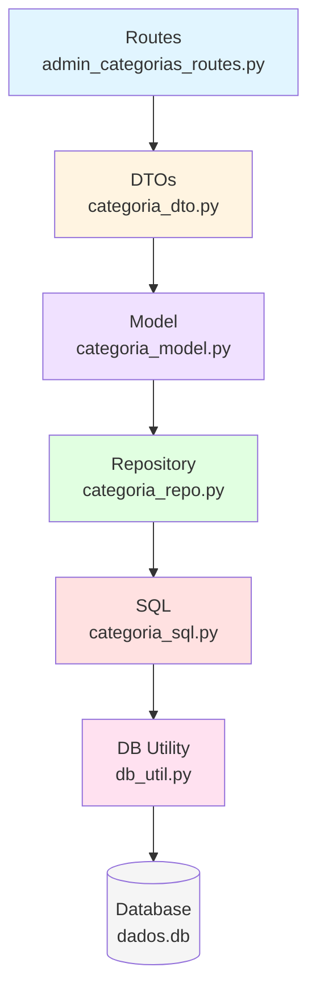
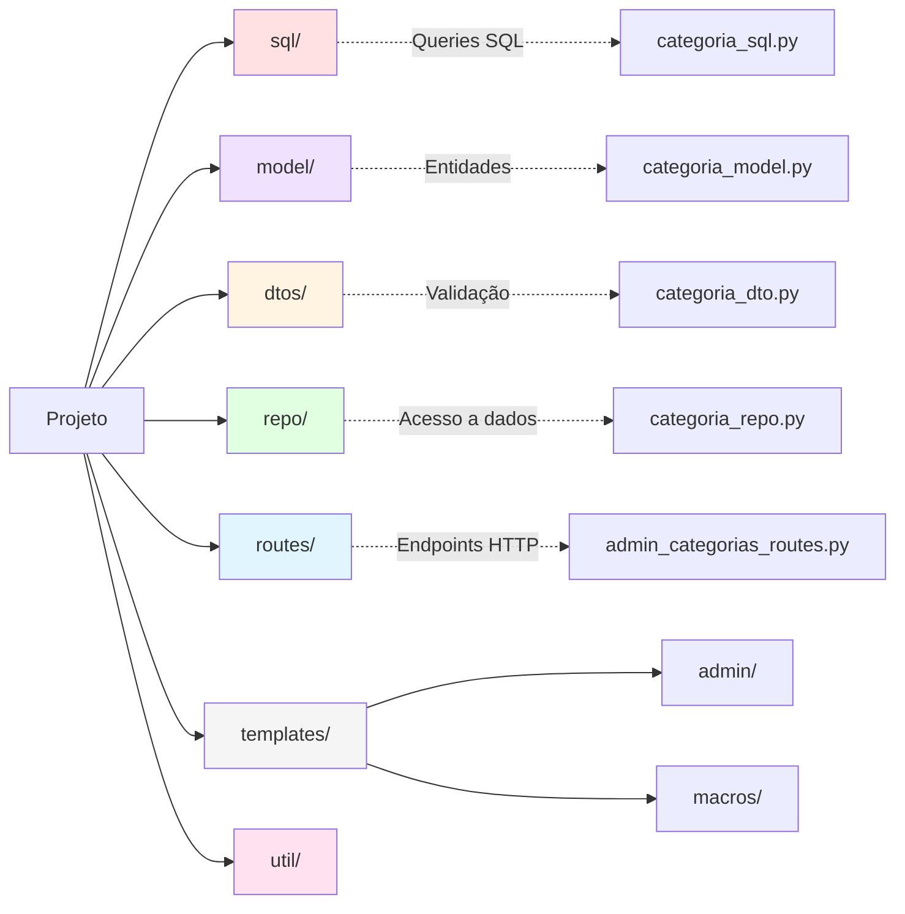
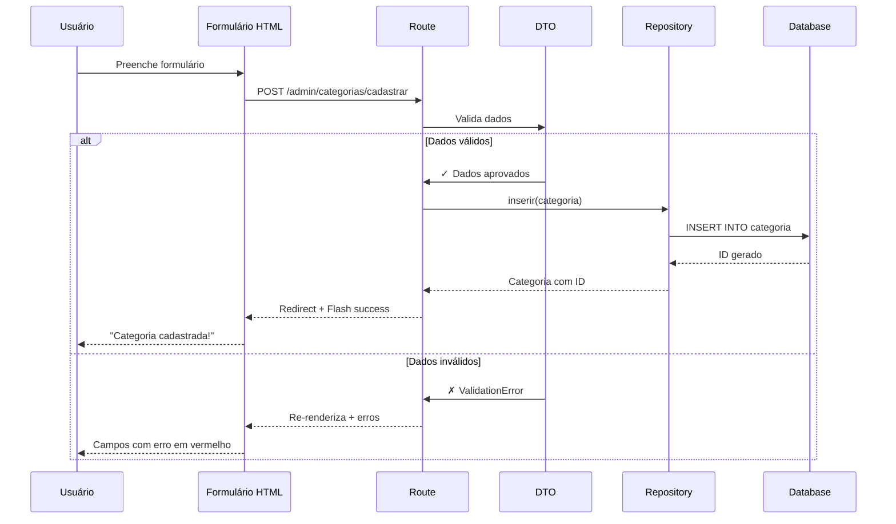

# Tutorial: Implementando um CRUD Completo no Projeto

## Índice

1. [Introdução](#introdução)
2. [Arquitetura do Projeto](#arquitetura-do-projeto)
3. [Visão Geral do que Vamos Construir](#visão-geral-do-que-vamos-construir)
4. [Passo 1: Criar as Queries SQL](#passo-1-criar-as-queries-sql)
5. [Passo 2: Criar o Modelo de Domínio](#passo-2-criar-o-modelo-de-domínio)
6. [Passo 3: Criar os DTOs de Validação](#passo-3-criar-os-dtos-de-validação)
7. [Passo 4: Criar o Repository](#passo-4-criar-o-repository)
8. [Passo 5: Registrar o Repository no Main](#passo-5-registrar-o-repository-no-main)
9. [Passo 6: Criar as Routes (Controllers)](#passo-6-criar-as-routes-controllers)
10. [Passo 7: Registrar as Routes no Main](#passo-7-registrar-as-routes-no-main)
11. [Passo 8: Criar o Template de Listagem](#passo-8-criar-o-template-de-listagem)
12. [Passo 9: Criar o Template de Cadastro](#passo-9-criar-o-template-de-cadastro)
13. [Passo 10: Criar o Template de Edição](#passo-10-criar-o-template-de-edição)
14. [Passo 11: Adicionar Link no Menu](#passo-11-adicionar-link-no-menu)
15. [Passo 12: Adicionar Card no Dashboard](#passo-12-adicionar-card-no-dashboard)
16. [Passo 13: Testar o CRUD Completo](#passo-13-testar-o-crud-completo)
17. [Padrões e Boas Práticas](#padrões-e-boas-práticas)
18. [Troubleshooting](#troubleshooting)
19. [Exercícios Propostos](#exercícios-propostos)

---

## Introdução

**CRUD** = **C**reate, **R**ead, **U**pdate, **D**elete - as 4 operações básicas com dados.

**Arquitetura em camadas**: Organização, manutenção, reutilização, trabalho em equipe e testabilidade.

---

## Arquitetura do Projeto



**Fluxo**: Route recebe POST → DTO valida → Repository salva → Database armazena → Redirect

---

## Visão Geral do que Vamos Construir

**CRUD de Categorias**: Listar, Cadastrar, Editar, Excluir

**Tabela**: `categoria` (id, nome único 3-50 chars, descricao opcional 200 chars, timestamps)

### Arquivos que Vamos Criar

```
Projeto/
├── sql/
│   └── categoria_sql.py          # Passo 1 (28 linhas)
├── model/
│   └── categoria_model.py        # Passo 2 (12 linhas)
├── dtos/
│   └── categoria_dto.py          # Passo 3 (36 linhas)
├── repo/
│   └── categoria_repo.py         # Passo 4 (135 linhas)
├── routes/
│   └── admin_categorias_routes.py # Passo 6 (246 linhas)
└── templates/admin/categorias/
    ├── listar.html               # Passo 8 (109 linhas)
    ├── cadastro.html             # Passo 9 (53 linhas)
    └── editar.html               # Passo 10 (53 linhas)
```

### Arquivos que Vamos Modificar

```
Projeto/
├── main.py                       # Passos 5 e 7 (+9 linhas)
└── templates/
    └── base_privada.html         # Passo 11 (+4 linhas)
```

**Total**: 685 linhas de código em 10 arquivos

---

## Passo 1: Criar as Queries SQL

### Objetivo

Criar um arquivo com todas as queries SQL necessárias para o CRUD de categorias.

### Por que fazer isso primeiro?

- É a camada mais básica (apenas strings)
- Não depende de nenhum outro arquivo
- Podemos revisar o SQL antes de implementar a lógica

### Arquivo a Criar

📁 `sql/categoria_sql.py`

### Código Completo

```python
# Queries SQL para operações com categorias

# Cria a tabela categoria se ela não existir
CRIAR_TABELA = """
    CREATE TABLE IF NOT EXISTS categoria (
        id INTEGER PRIMARY KEY AUTOINCREMENT,
        nome TEXT UNIQUE NOT NULL,
        descricao TEXT,
        data_cadastro TIMESTAMP DEFAULT CURRENT_TIMESTAMP,
        data_atualizacao TIMESTAMP
    )
"""

# Insere uma nova categoria
INSERIR = """
    INSERT INTO categoria (nome, descricao)
    VALUES (?, ?)
"""

# Atualiza uma categoria existente
ALTERAR = """
    UPDATE categoria
    SET nome=?, descricao=?, data_atualizacao=CURRENT_TIMESTAMP
    WHERE id=?
"""

# Exclui uma categoria
EXCLUIR = """
    DELETE FROM categoria WHERE id=?
"""

# Busca todas as categorias ordenadas por nome
OBTER_TODOS = """
    SELECT id, nome, descricao, data_cadastro, data_atualizacao
    FROM categoria
    ORDER BY nome
"""

# Busca uma categoria por ID
OBTER_POR_ID = """
    SELECT id, nome, descricao, data_cadastro, data_atualizacao
    FROM categoria
    WHERE id=?
"""

# Busca uma categoria por nome
OBTER_POR_NOME = """
    SELECT id, nome, descricao, data_cadastro, data_atualizacao
    FROM categoria
    WHERE nome=?
"""
```

### Explicação Detalhada

**CREATE TABLE**: `IF NOT EXISTS` evita erro. `id` com `AUTOINCREMENT`, `nome` com `UNIQUE NOT NULL`, `data_cadastro` com `DEFAULT CURRENT_TIMESTAMP`.

**Placeholders `?`**: Previnem SQL Injection. Sempre use `cursor.execute(SQL, (valor1, valor2))` em vez de f-strings.

**UPDATE**: Usa `CURRENT_TIMESTAMP` para `data_atualizacao`. Sempre com `WHERE id=?`.

**SELECT**: Lista campos explícitos. `ORDER BY nome` retorna alfabeticamente.

### ✅ Checkpoint

Após criar este arquivo:

1. Verifique se o arquivo está em `sql/categoria_sql.py`
2. Certifique-se de que não há erros de sintaxe
3. Execute o comando para testar importação:

```bash
python -c "from sql.categoria_sql import CRIAR_TABELA; print('OK!')"
```

Se aparecer `OK!`, está tudo certo! 🎉

---

## Passo 2: Criar o Modelo de Domínio

### Objetivo

Criar uma classe Python que representa uma Categoria com todos os seus atributos.

### Por que precisamos disso?

Usar **classes** em vez de dicionários oferece:
- Autocompletar do editor
- Detecção de erros de digitação
- Validação de tipos
- Métodos úteis

### Arquivo a Criar

📁 `model/categoria_model.py`

### Código Completo

```python
from dataclasses import dataclass
from datetime import datetime
from typing import Optional

@dataclass
class Categoria:
    """
    Representa uma categoria de algo do projeto.

    Atributos:
        id: Identificador único da categoria
        nome: Nome da categoria (ex: "Tecnologia")
        descricao: Descrição opcional da categoria
        data_cadastro: Data/hora de criação do registro
        data_atualizacao: Data/hora da última atualização
    """
    id: Optional[int] = None
    nome: str = ""
    descricao: str = ""
    data_cadastro: Optional[datetime] = None
    data_atualizacao: Optional[datetime] = None
```

### Explicação Detalhada

#### @dataclass

```python
@dataclass
class Categoria:
```

`@dataclass` é um **decorador** que transforma a classe em uma estrutura de dados eficiente.

Sem `@dataclass` teríamos que escrever:
```python
class Categoria:
    def __init__(self, id, nome, descricao, data_cadastro, data_atualizacao):
        self.id = id
        self.nome = nome
        self.descricao = descricao
        self.data_cadastro = data_cadastro
        self.data_atualizacao = data_atualizacao

    def __repr__(self):
        return f"Categoria(id={self.id}, nome={self.nome}...)"
```

Com `@dataclass`, tudo isso é gerado automaticamente! 🎉

#### Tipos dos Campos

```python
id: Optional[int] = None
```

- `Optional[int]`: Pode ser um número inteiro OU `None`
- `= None`: Valor padrão é `None` (útil ao criar nova categoria sem ID, pois ID será gerado pelo BD)

```python
nome: str = ""
```

- `str`: Deve ser uma string (texto)
- `= ""`: Valor padrão é string vazia

```python
data_cadastro: Optional[datetime] = None
```

- `datetime`: Objeto de data/hora do Python
- `Optional`: Pode ser `None` (quando ainda não foi salvo no BD)

### Como Usar

```python
# Criar uma nova categoria (antes de salvar no BD)
nova_categoria = Categoria(
    nome="Esportes",
    descricao="Notícias esportivas"
)
print(nova_categoria.id)  # None (ainda não tem ID)
nova_categoria_bd = categoria_repo.inserir(nova_categoria) # Salva no BD e retorna com ID
print(nova_categoria_bd.id)  # Mostra o ID gerado pelo BD
```

### ✅ Checkpoint

Arquivo em `model/categoria_model.py`. Teste: `python -c "from model.categoria_model import Categoria; print(Categoria(nome='Teste', descricao='Desc').nome)"`

---

## Passo 3: Criar os DTOs de Validação

### Objetivo

Criar classes que validam os dados vindos dos formulários antes de processá-los.

### O que é um DTO?

**DTO** significa **Data Transfer Object** (Objeto de Transferência de Dados).

É uma classe que:
- Recebe dados "crus" de um formulário
- Valida se estão corretos
- Se estão errados, gera mensagens de erro claras
- Se estão corretos, permite prosseguir

### Por que precisamos?

Imagine um usuário mal-intencionado tentando:
- Cadastrar categoria com nome vazio
- Nome com 500 caracteres
- Nome com caracteres especiais perigosos

O DTO **protege** nossa aplicação dessas situações! 🛡️

### Arquivo a Criar

📁 `dtos/categoria_dto.py`

### Código Completo

```python
from pydantic import BaseModel, field_validator
from dtos.validators import validar_string_obrigatoria, validar_comprimento

class CriarCategoriaDTO(BaseModel):
    """
    DTO para validar dados ao criar uma nova categoria.

    Regras:
    - nome: obrigatório, entre 3 e 50 caracteres
    - descricao: opcional, máximo 200 caracteres
    """
    nome: str
    descricao: str = ""

    # Validador do campo 'nome'
    _validar_nome = field_validator("nome")(
        validar_string_obrigatoria(
            nome_campo="Nome",  # ⚠️ Atenção: o parâmetro correto é 'nome_campo'
            tamanho_minimo=3,
            tamanho_maximo=50
        )
    )

    # Validador do campo 'descricao'
    _validar_descricao = field_validator("descricao")(
        validar_comprimento(tamanho_maximo=200)
    )

    class Config:
        """Configurações do Pydantic"""
        str_strip_whitespace = True  # Remove espaços extras no início/fim


class AlterarCategoriaDTO(BaseModel):
    """
    DTO para validar dados ao editar uma categoria existente.

    Regras: mesmas do CriarCategoriaDTO
    """
    nome: str
    descricao: str = ""

    _validar_nome = field_validator("nome")(
        validar_string_obrigatoria(
            nome_campo="Nome",  # ⚠️ Sempre use 'nome_campo'
            tamanho_minimo=3,
            tamanho_maximo=50
        )
    )

    _validar_descricao = field_validator("descricao")(
        validar_comprimento(tamanho_maximo=200)
    )

    class Config:
        str_strip_whitespace = True
```

### Explicação Detalhada

#### Pydantic

```python
from pydantic import BaseModel, field_validator
```

**Pydantic** é uma biblioteca Python que faz validação automática de dados.

Vantagens:
- Validação automática de tipos
- Mensagens de erro claras
- Muito usada no FastAPI

#### Campos

```python
class CriarCategoriaDTO(BaseModel):
    nome: str
    descricao: str = ""
```

- `nome: str` → Campo obrigatório do tipo string
- `descricao: str = ""` → Campo opcional com valor padrão vazio

#### Validadores Reutilizáveis

```python
_validar_nome = field_validator("nome")(
    validar_string_obrigatoria(
        nome_campo="Nome",
        tamanho_minimo=3,
        tamanho_maximo=50
    )
)
```

Vamos destrinchar:

1. `field_validator("nome")`: Aplica validação ao campo `nome`
2. `validar_string_obrigatoria(...)`: Função que retorna um validador
3. Parâmetros:
   - `nome_campo="Nome"`: Nome para exibir na mensagem de erro
   - `tamanho_minimo=3`: Mínimo de 3 caracteres
   - `tamanho_maximo=50`: Máximo de 50 caracteres

**⚠️ IMPORTANTE**: O parâmetro correto é `nome_campo`, não `campo`. Isso é consistente com todos os validadores em `dtos/validators.py`.

**Esta função `validar_string_obrigatoria` já existe no projeto!**
Ela está em `dtos/validators.py` e pode ser reutilizada.

#### Configurações

```python
class Config:
    str_strip_whitespace = True
```

`str_strip_whitespace = True` remove espaços extras:
- `"  Tecnologia  "` → `"Tecnologia"`
- Evita erros de usuários que digitam espaços sem querer

### Como Funciona na Prática

#### Exemplo 1: Dados Válidos ✅

```python
from dtos.categoria_dto import CriarCategoriaDTO

dados = {"nome": "Tecnologia", "descricao": "Artigos sobre tecnologia"}
dto = CriarCategoriaDTO(**dados)
print(dto.nome)  # "Tecnologia"
```

#### Exemplo 2: Erro de Validação ❌

```python
dados = {"nome": "TI", "descricao": "Desc"}  # Nome com apenas 2 caracteres
try:
    dto = CriarCategoriaDTO(**dados)
except ValidationError as e:
    print(e)  # Erro: Nome deve ter no mínimo 3 caracteres
```

### Por que Dois DTOs?

```python
class CriarCategoriaDTO(BaseModel):
    # ...

class AlterarCategoriaDTO(BaseModel):
    # ...
```

Neste caso, as validações são iguais, mas em projetos maiores podem ser diferentes:

- **Criar**: Pode exigir senha, email de confirmação
- **Alterar**: Pode permitir mudar apenas alguns campos

É uma boa prática separar para facilitar manutenção futura.

### ✅ Checkpoint

Após criar este arquivo:

1. Verifique se o arquivo está em `dtos/categoria_dto.py`
2. Teste a validação:

```bash
python -c "
from dtos.categoria_dto import CriarCategoriaDTO

# Teste 1: Dados válidos
dto = CriarCategoriaDTO(nome='Tecnologia', descricao='Desc')
print(f'✅ Válido: {dto.nome}')

# Teste 2: Nome muito curto (deve dar erro)
try:
    dto2 = CriarCategoriaDTO(nome='AB', descricao='Desc')
except Exception as e:
    print(f'✅ Erro esperado: nome muito curto')

print('OK!')
"
```

---

## Passo 4: Criar o Repository

### Objetivo

Criar um arquivo com todas as funções que acessam o banco de dados para realizar operações CRUD.

### O que é o Padrão Repository?

**Repository** (Repositório) é um padrão de projeto que:
- Encapsula toda a lógica de acesso ao banco de dados
- Fornece uma interface simples para as outras camadas
- Facilita trocar o banco de dados no futuro


### Arquivo a Criar

📁 `repo/categoria_repo.py`

### Código Completo

```python
from typing import Optional
from model.categoria_model import Categoria
from sql.categoria_sql import *
from util.db_util import get_connection

def criar_tabela():
    """
    Cria a tabela de categorias se ela não existir.
    Deve ser chamada na inicialização do sistema.
    """
    with get_connection() as conn:
        cursor = conn.cursor()
        cursor.execute(CRIAR_TABELA)


def inserir(categoria: Categoria) -> Optional[Categoria]:
    """
    Insere uma nova categoria no banco de dados.

    Args:
        categoria: Objeto Categoria com nome e descrição

    Returns:
        Categoria com ID preenchido se sucesso, None se erro

    Exemplo:
        nova = Categoria(nome="Esportes", descricao="Notícias esportivas")
        resultado = inserir(nova)
        if resultado:
            print(f"Categoria criada com ID: {resultado.id}")
    """
    try:
        with get_connection() as conn:
            cursor = conn.cursor()
            cursor.execute(INSERIR, (categoria.nome, categoria.descricao))

            # Pega o ID gerado automaticamente
            if cursor.lastrowid:
                categoria.id = cursor.lastrowid
                return categoria
            return None
    except Exception as e:
        print(f"Erro ao inserir categoria: {e}")
        return None


def alterar(categoria: Categoria) -> bool:
    """
    Atualiza uma categoria existente.

    Args:
        categoria: Objeto Categoria com ID, nome e descrição

    Returns:
        True se atualizou, False se erro

    Exemplo:
        cat = obter_por_id(5)
        cat.nome = "Novo Nome"
        if alterar(cat):
            print("Categoria atualizada!")
    """
    try:
        with get_connection() as conn:
            cursor = conn.cursor()
            cursor.execute(
                ALTERAR,
                (categoria.nome, categoria.descricao, categoria.id)
            )
            return cursor.rowcount > 0
    except Exception as e:
        print(f"Erro ao alterar categoria: {e}")
        return False


def excluir(id: int) -> bool:
    """
    Exclui uma categoria do banco de dados.

    Args:
        id: ID da categoria a ser excluída

    Returns:
        True se excluiu, False se erro ou não encontrou

    Exemplo:
        if excluir(5):
            print("Categoria excluída!")
        else:
            print("Categoria não encontrada")
    """
    try:
        with get_connection() as conn:
            cursor = conn.cursor()
            cursor.execute(EXCLUIR, (id,))
            return cursor.rowcount > 0
    except Exception as e:
        print(f"Erro ao excluir categoria: {e}")
        return False


def obter_por_id(id: int) -> Optional[Categoria]:
    """
    Busca uma categoria por ID.

    Args:
        id: ID da categoria

    Returns:
        Objeto Categoria se encontrou, None se não encontrou

    Exemplo:
        cat = obter_por_id(5)
        if cat:
            print(f"Encontrada: {cat.nome}")
        else:
            print("Categoria não existe")
    """
    try:
        with get_connection() as conn:
            cursor = conn.cursor()
            cursor.execute(OBTER_POR_ID, (id,))
            row = cursor.fetchone()

            if row:
                return Categoria(
                    id=row["id"],
                    nome=row["nome"],
                    descricao=row["descricao"],
                    data_cadastro=row["data_cadastro"],
                    data_atualizacao=row["data_atualizacao"]
                )
            return None
    except Exception as e:
        print(f"Erro ao obter categoria por ID: {e}")
        return None


def obter_todos() -> list[Categoria]:
    """
    Retorna todas as categorias do banco de dados.

    Returns:
        Lista de objetos Categoria (pode ser vazia)

    Exemplo:
        categorias = obter_todos()
        for cat in categorias:
            print(f"{cat.id} - {cat.nome}")
    """
    try:
        with get_connection() as conn:
            cursor = conn.cursor()
            cursor.execute(OBTER_TODOS)
            rows = cursor.fetchall()

            return [
                Categoria(
                    id=row["id"],
                    nome=row["nome"],
                    descricao=row["descricao"],
                    data_cadastro=row["data_cadastro"],
                    data_atualizacao=row["data_atualizacao"]
                )
                for row in rows
            ]
    except Exception as e:
        print(f"Erro ao obter todas as categorias: {e}")
        return []


def obter_por_nome(nome: str) -> Optional[Categoria]:
    """
    Busca uma categoria pelo nome exato.
    Útil para verificar se já existe categoria com aquele nome.

    Args:
        nome: Nome da categoria (case-sensitive)

    Returns:
        Objeto Categoria se encontrou, None se não encontrou

    Exemplo:
        if obter_por_nome("Tecnologia"):
            print("Já existe categoria com este nome")
        else:
            print("Nome disponível")
    """
    try:
        with get_connection() as conn:
            cursor = conn.cursor()
            cursor.execute(OBTER_POR_NOME, (nome,))
            row = cursor.fetchone()

            if row:
                return Categoria(
                    id=row["id"],
                    nome=row["nome"],
                    descricao=row["descricao"],
                    data_cadastro=row["data_cadastro"],
                    data_atualizacao=row["data_atualizacao"]
                )
            return None
    except Exception as e:
        print(f"Erro ao obter categoria por nome: {e}")
        return None
```

### Explicação Detalhada

**Context Manager `with get_connection()`**: Garante abertura, commit/rollback automático e fechamento da conexão.

**Funções principais**:
- `criar_tabela()`: Executa SQL `CREATE TABLE IF NOT EXISTS`
- `inserir()`: Usa `cursor.lastrowid` para obter ID gerado
- `alterar()` e `excluir()`: Retornam `cursor.rowcount > 0` (True se afetou linhas)
- `obter_por_id()` e `obter_por_nome()`: Usam `cursor.fetchone()`
- `obter_todos()`: Usa `cursor.fetchall()` com list comprehension

**Acesso a colunas**: `row["id"]` funciona graças ao `row_factory` configurado em `db_util.py`

### ✅ Checkpoint

Teste: `python -c "from repo import categoria_repo; from model.categoria_model import Categoria; categoria_repo.criar_tabela(); print(categoria_repo.inserir(Categoria(nome='Teste', descricao='Desc')).id)"`

---

## Passo 5: Registrar o Repository no Main

### Objetivo

Fazer o sistema reconhecer e inicializar o repository de categorias quando a aplicação iniciar.

### Por que fazer isso?

- A tabela precisa ser criada antes de usar
- O main.py é o "coração" da aplicação
- Todas as funcionalidades são registradas lá

### Arquivo a Modificar

📁 `main.py`

### Mudanças a Fazer

Vamos adicionar **3 linhas** no arquivo `main.py`:

#### 1. Importar o Repository (próximo aos outros imports)

Procure a seção de imports dos repositories (deve estar perto de `from repo import usuario_repo`):

```python
from repo import usuario_repo, comentario_repo
```

**Adicione** `categoria_repo`:

```python
from repo import usuario_repo, comentario_repo, categoria_repo
```

#### 2. Criar a Tabela (dentro da função que cria tabelas)

Procure a função que cria as tabelas (na seção "Banco de dados e seeds"):

```python
    # ------------------------------------------------------------
    # Banco de dados e seeds
    # ------------------------------------------------------------
    try:
        logger.info("🛠️ Criando/verificando tabelas do banco de dados...")
        usuario_repo.criar_tabela()
        ...
        indices_repo.criar_indices()
```

**Adicione** a criação da tabela de categorias:

```python
    # ------------------------------------------------------------
    # Banco de dados e seeds
    # ------------------------------------------------------------
    try:
        logger.info("🛠️ Criando/verificando tabelas do banco de dados...")
        usuario_repo.criar_tabela()
        ...
        indices_repo.criar_indices()
        categoria_repo.criar_tabela()  # ← ADICIONE ESTA LINHA
```

### Explicação

#### Import do Repository

```python
from repo import categoria_repo
```

Isso torna todas as funções do `categoria_repo` disponíveis:
- `categoria_repo.criar_tabela()`
- `categoria_repo.inserir()`
- `categoria_repo.obter_todos()`
- etc.

#### Criação da Tabela

```python
categoria_repo.criar_tabela()
```

- Chamado quando o sistema inicia
- Cria a tabela `categoria` se não existir
- Se já existir, não faz nada (graças ao `IF NOT EXISTS`)

### ✅ Checkpoint

Após fazer essas modificações:

1. Execute a aplicação:

```bash
uvicorn main:app --reload
```

2. Verifique no terminal se não há erros
3. Acesse o banco de dados para verificar se a tabela foi criada:

```bash
sqlite3 dados.db "SELECT name FROM sqlite_master WHERE type='table' AND name='categoria';"
```

Se retornar `categoria`, a tabela foi criada com sucesso! 🎉

4. Pare a aplicação (Ctrl+C)

---

## Passo 6: Criar as Routes (Controllers)

### Objetivo

Criar os endpoints HTTP que receberão as requisições do navegador e responderão com as páginas HTML.

### O que são Routes?

**Routes** (rotas) são os **controladores** da aplicação. Eles:
- Recebem requisições HTTP (GET, POST)
- Validam os dados usando DTOs
- Chamam o Repository para acessar/modificar dados
- Retornam páginas HTML ou fazem redirects


### ⚠️ IMPORTANTE: Proteção CSRF

**Todas as rotas POST/PUT/PATCH/DELETE** no Projeto são protegidas por **CSRF (Cross-Site Request Forgery)**.

Isso significa que:
- Todos os formulários HTML **DEVEM** incluir um token CSRF
- O middleware valida automaticamente o token
- Sem o token, requisições são rejeitadas com erro 403

Não se preocupe! Os templates já incluem o token automaticamente quando você usa as práticas corretas que veremos adiante.

### Arquivo a Criar

📁 `routes/admin_categorias_routes.py`

Este é o arquivo mais longo (246 linhas), mas vamos explicar cada parte.

### Estrutura Geral

```python
# Imports
from fastapi import APIRouter, Request, Form, status
from fastapi.responses import RedirectResponse
# ... outros imports

# Configuração do Router
router = APIRouter(prefix="/admin/categorias")

# Rate Limiting (Controle de requisições)
admin_categorias_limiter = RateLimiter(...)

# Endpoints (7 funções)
1. index() - Redireciona para /listar
2. listar() - Lista todas as categorias
3. get_cadastrar() - Exibe formulário de cadastro
4. post_cadastrar() - Processa cadastro
5. get_editar() - Exibe formulário de edição
6. post_editar() - Processa edição
7. post_excluir() - Exclui categoria
```

### Código Completo - Parte 1: Imports e Configuração

```python
from typing import Optional
from fastapi import APIRouter, Request, Form, status
from fastapi.responses import RedirectResponse
from pydantic import ValidationError

from dtos.categoria_dto import CriarCategoriaDTO, AlterarCategoriaDTO
from model.categoria_model import Categoria
from repo import categoria_repo
from util.auth_decorator import requer_autenticacao
from util.flash_messages import informar_sucesso, informar_erro
from util.rate_limiter import RateLimiter, obter_identificador_cliente
from util.exceptions import FormValidationError
from util.perfis import Perfil
from util.template_util import criar_templates

# Configura o roteador com prefixo /admin/categorias
router = APIRouter(prefix="/admin/categorias")

# Configura os templates HTML com as funções globais necessárias (csrf_input, etc.)
templates = criar_templates("templates")

# Rate Limiter: máximo 10 operações por minuto
admin_categorias_limiter = RateLimiter(
    max_tentativas=10,
    janela_minutos=1,
    nome="admin_categorias"
)
```

### Código Completo - Parte 2: Endpoints de Listagem

```python
@router.get("/")
@requer_autenticacao([Perfil.ADMIN.value])
async def index(request: Request, usuario_logado: Optional[dict] = None):
    """Redireciona a raiz para /listar"""
    return RedirectResponse(
        url="/admin/categorias/listar",
        status_code=status.HTTP_303_SEE_OTHER
    )


@router.get("/listar")
@requer_autenticacao([Perfil.ADMIN.value])
async def listar(request: Request, usuario_logado: Optional[dict] = None):
    """
    Lista todas as categorias.
    Acessível em: GET /admin/categorias/listar
    """
    # Busca todas as categorias do banco
    categorias = categoria_repo.obter_todos()

    # Renderiza o template com os dados
    return templates.TemplateResponse(
        "admin/categorias/listar.html",
        {
            "request": request,
            "usuario_logado": usuario_logado,
            "categorias": categorias
        }
    )
```

### Código Completo - Parte 3: Endpoints de Cadastro

```python
@router.get("/cadastrar")
@requer_autenticacao([Perfil.ADMIN.value])
async def get_cadastrar(request: Request, usuario_logado: Optional[dict] = None):
    """
    Exibe o formulário de cadastro.
    Acessível em: GET /admin/categorias/cadastrar
    """
    return templates.TemplateResponse(
        "admin/categorias/cadastro.html",
        {
            "request": request,
            "usuario_logado": usuario_logado
        }
    )


@router.post("/cadastrar")
@requer_autenticacao([Perfil.ADMIN.value])
async def post_cadastrar(
    request: Request,
    usuario_logado: Optional[dict] = None,
    nome: str = Form(""),
    descricao: str = Form("")
):
    """
    Processa o cadastro de uma nova categoria.
    Acessível em: POST /admin/categorias/cadastrar
    """
    # Verifica rate limiting
    ip = obter_identificador_cliente(request)
    if not admin_categorias_limiter.verificar(ip):
        informar_erro(
            request,
            "Muitas operações em pouco tempo. Aguarde um momento e tente novamente."
        )
        return RedirectResponse(
            url="/admin/categorias/cadastrar",
            status_code=status.HTTP_303_SEE_OTHER
        )

    try:
        # Valida os dados com o DTO
        dto = CriarCategoriaDTO(nome=nome, descricao=descricao)

        # Verifica se já existe categoria com este nome
        categoria_existente = categoria_repo.obter_por_nome(dto.nome)
        if categoria_existente:
            informar_erro(request, "Já existe uma categoria com este nome.")
            return RedirectResponse(
                url="/admin/categorias/cadastrar",
                status_code=status.HTTP_303_SEE_OTHER
            )

        # Cria o objeto Categoria
        nova_categoria = Categoria(
            nome=dto.nome,
            descricao=dto.descricao
        )

        # Insere no banco de dados
        categoria_inserida = categoria_repo.inserir(nova_categoria)

        if categoria_inserida:
            informar_sucesso(request, "Categoria cadastrada com sucesso!")
            return RedirectResponse(
                url="/admin/categorias/listar",
                status_code=status.HTTP_303_SEE_OTHER
            )
        else:
            informar_erro(request, "Erro ao cadastrar categoria.")
            return RedirectResponse(
                url="/admin/categorias/cadastrar",
                status_code=status.HTTP_303_SEE_OTHER
            )

    except ValidationError as e:
        # Em caso de erro de validação, levanta exception
        # que será capturada pelo handler global
        raise FormValidationError(
            validation_error=e,
            template_path="admin/categorias/cadastro.html",
            dados_formulario={"nome": nome, "descricao": descricao},
            campo_padrao="nome"
        )
```

#### ⭐ Padrão FormValidationError (MUITO IMPORTANTE!)

O `FormValidationError` é um **padrão fundamental** usado em todo o Projeto. Quando você faz `raise FormValidationError(...)`, um **handler global** (`util/exception_handlers.py`) automaticamente:

1. Processa o `ValidationError` e extrai erros por campo
2. Cria mensagem flash
3. Renderiza o template com `erros` e `dados` para repopular o formulário

**Uso correto**:
```python
except ValidationError as e:
    raise FormValidationError(
        validation_error=e,
        template_path="admin/categorias/cadastro.html",
        dados_formulario={"nome": nome, "descricao": descricao},
        campo_padrao="nome"  # Campo que receberá foco em caso de erro
    )
```

**Resultado**: Você economiza ~15 linhas de código por endpoint!

### Código Completo - Parte 4: Endpoints de Edição

```python
@router.get("/editar/{id}")
@requer_autenticacao([Perfil.ADMIN.value])
async def get_editar(
    request: Request,
    id: int,
    usuario_logado: Optional[dict] = None
):
    """
    Exibe o formulário de edição de uma categoria.
    Acessível em: GET /admin/categorias/editar/1
    """
    # Busca a categoria pelo ID
    categoria = categoria_repo.obter_por_id(id)

    if not categoria:
        informar_erro(request, "Categoria não encontrada.")
        return RedirectResponse(
            url="/admin/categorias/listar",
            status_code=status.HTTP_303_SEE_OTHER
        )

    # Renderiza o formulário com os dados da categoria
    return templates.TemplateResponse(
        "admin/categorias/editar.html",
        {
            "request": request,
            "usuario_logado": usuario_logado,
            "categoria": categoria
        }
    )


@router.post("/editar/{id}")
@requer_autenticacao([Perfil.ADMIN.value])
async def post_editar(
    request: Request,
    id: int,
    usuario_logado: Optional[dict] = None,
    nome: str = Form(""),
    descricao: str = Form("")
):
    """
    Processa a edição de uma categoria.
    Acessível em: POST /admin/categorias/editar/1
    """
    # Verifica rate limiting
    ip = obter_identificador_cliente(request)
    if not admin_categorias_limiter.verificar(ip):
        informar_erro(
            request,
            "Muitas operações em pouco tempo. Aguarde um momento e tente novamente."
        )
        return RedirectResponse(
            url=f"/admin/categorias/editar/{id}",
            status_code=status.HTTP_303_SEE_OTHER
        )

    # Busca a categoria atual
    categoria_atual = categoria_repo.obter_por_id(id)
    if not categoria_atual:
        informar_erro(request, "Categoria não encontrada.")
        return RedirectResponse(
            url="/admin/categorias/listar",
            status_code=status.HTTP_303_SEE_OTHER
        )

    try:
        # Valida os dados
        dto = AlterarCategoriaDTO(nome=nome, descricao=descricao)

        # Se o nome mudou, verifica se não existe outra categoria com o novo nome
        if dto.nome != categoria_atual.nome:
            categoria_existente = categoria_repo.obter_por_nome(dto.nome)
            if categoria_existente:
                informar_erro(request, "Já existe uma categoria com este nome.")
                return RedirectResponse(
                    url=f"/admin/categorias/editar/{id}",
                    status_code=status.HTTP_303_SEE_OTHER
                )

        # Atualiza os dados da categoria
        categoria_atual.nome = dto.nome
        categoria_atual.descricao = dto.descricao

        # Salva no banco
        if categoria_repo.alterar(categoria_atual):
            informar_sucesso(request, "Categoria alterada com sucesso!")
            return RedirectResponse(
                url="/admin/categorias/listar",
                status_code=status.HTTP_303_SEE_OTHER
            )
        else:
            informar_erro(request, "Erro ao alterar categoria.")
            return RedirectResponse(
                url=f"/admin/categorias/editar/{id}",
                status_code=status.HTTP_303_SEE_OTHER
            )

    except ValidationError as e:
        raise FormValidationError(
            validation_error=e,
            template_path="admin/categorias/editar.html",
            dados_formulario={
                "nome": nome,
                "descricao": descricao,
                "id": id
            },
            campo_padrao="nome"
        )
```

### Código Completo - Parte 5: Endpoint de Exclusão

```python
@router.post("/excluir/{id}")
@requer_autenticacao([Perfil.ADMIN.value])
async def post_excluir(
    request: Request,
    id: int,
    usuario_logado: Optional[dict] = None
):
    """
    Exclui uma categoria.
    Acessível em: POST /admin/categorias/excluir/1
    """
    # Verifica rate limiting
    ip = obter_identificador_cliente(request)
    if not admin_categorias_limiter.verificar(ip):
        informar_erro(
            request,
            "Muitas operações em pouco tempo. Aguarde um momento e tente novamente."
        )
        return RedirectResponse(
            url="/admin/categorias/listar",
            status_code=status.HTTP_303_SEE_OTHER
        )

    # Busca a categoria
    categoria = categoria_repo.obter_por_id(id)
    if not categoria:
        informar_erro(request, "Categoria não encontrada.")
        return RedirectResponse(
            url="/admin/categorias/listar",
            status_code=status.HTTP_303_SEE_OTHER
        )

    # Exclui do banco
    if categoria_repo.excluir(id):
        informar_sucesso(request, f"Categoria '{categoria.nome}' excluída com sucesso!")
    else:
        informar_erro(request, "Erro ao excluir categoria.")

    return RedirectResponse(
        url="/admin/categorias/listar",
        status_code=status.HTTP_303_SEE_OTHER
    )
```

### Explicação Detalhada

#### Decoradores

```python
@router.get("/listar")
@requer_autenticacao([Perfil.ADMIN.value])
async def listar(request: Request, usuario_logado: Optional[dict] = None):
```

1. `@router.get("/listar")`: Define que esta função responde a `GET /admin/categorias/listar`
2. `@requer_autenticacao([Perfil.ADMIN.value])`: Só admins podem acessar
3. `usuario_logado`: Preenchido automaticamente pelo decorator

#### Parâmetros Form

```python
async def post_cadastrar(
    request: Request,
    usuario_logado: Optional[dict] = None,
    nome: str = Form(""),
    descricao: str = Form("")
):
```

- `nome: str = Form("")`: Pega o campo `nome` do formulário HTML
- Se não existir, usa string vazia como padrão

#### Rate Limiting

```python
ip = obter_identificador_cliente(request)
if not admin_categorias_limiter.verificar(ip):
    informar_erro(request, "Muitas operações...")
```

- Limita a 10 operações por minuto por IP
- Previne spam e abuso

#### Validação com DTO

```python
try:
    dto = CriarCategoriaDTO(nome=nome, descricao=descricao)
except Exception as e:
    raise FormValidationError(...)
```

- Se dados inválidos → Pydantic lança exception
- `FormValidationError`: Re-lança como exception customizada
- Handler global processa e mostra erros no formulário

#### Verificação de Duplicidade

```python
categoria_existente = categoria_repo.obter_por_nome(dto.nome)
if categoria_existente:
    informar_erro(request, "Já existe uma categoria com este nome.")
```

- Evita categorias duplicadas
- Melhor fazer aqui do que confiar apenas no UNIQUE do BD

#### RedirectResponse

```python
return RedirectResponse(
    url="/admin/categorias/listar",
    status_code=status.HTTP_303_SEE_OTHER
)
```

- Redireciona o navegador para outra página
- `303 SEE OTHER`: Código HTTP para redirect após POST

#### TemplateResponse

```python
return templates.TemplateResponse(
    "admin/categorias/listar.html",
    {
        "request": request,
        "usuario_logado": usuario_logado,
        "categorias": categorias
    }
)
```

- Renderiza template HTML
- Passa variáveis para o template (request, usuario, categorias)

### Padrão POST-REDIRECT-GET

Todas as operações POST fazem redirect:

```
POST /cadastrar → Salva no BD → Redirect para /listar
```

**Por que?**
- Se usuário der F5 (refresh), não envia formulário novamente
- Evita duplicação de dados
- Melhor experiência de usuário

### ✅ Checkpoint

Após criar este arquivo:

1. Verifique se está em `routes/admin_categorias_routes.py`
2. Execute a aplicação:

```bash
uvicorn main:app --reload
```

3. Acesse no navegador (deve dar erro 404 de template, mas a rota existe):

```
http://localhost:8406/admin/categorias/listar
```

Se aparecer erro "Template not found", está correto! Vamos criar os templates nos próximos passos.

---

## Passo 7: Registrar as Routes no Main

### Objetivo

Fazer o FastAPI reconhecer e usar as routes de categorias.

### Arquivo a Modificar

📁 `main.py`

### Mudanças a Fazer

#### 1. Importar o Router

Procure a seção de imports dos routers e adicione:

```python
from routes.admin_categorias_routes import router as admin_categorias_router
```

#### 2. Registrar o Router

Procure a seção onde os routers são registrados e adicone a linha indicada

```python
    # ------------------------------------------------------------
    # Registro das rotas
    # ------------------------------------------------------------
    routers = [
        auth_router,
        ...
        examples_router,
        admin_categorias_router, # ← ADICIONE ESTA LINHA
    ]
```

### Explicação

Essa lista de rotas é percorrida e cada router é registrado na aplicação FastAPI. Ao adicionar o `admin_categorias_router`, todas as rotas definidas em `admin_categorias_routes.py` estarão disponíveis na aplicação.

### ✅ Checkpoint

1. Reinicie a aplicação
2. Acesse a documentação automática:

```
http://localhost:8406/docs
```

3. Deve listar os 7 endpoints criados

---

## Passo 8: Criar o Template de Listagem

### Objetivo

Criar a página HTML que exibe todas as categorias em uma tabela.

### Arquivo a Criar

📁 `templates/admin/categorias/listar.html`

Primeiro, crie a pasta:

```bash
mkdir -p templates/admin/categorias
```

### Código Completo

```html




Gerenciar Categorias


<div class="row">
    <div class="col-12">
        <div class="d-flex justify-content-between align-items-center mb-4">
            <h2><i class="bi bi-folder"></i> Gerenciar Categorias</h2>
            <a href="/admin/categorias/cadastrar" class="btn btn-primary">
                <i class="bi bi-plus-circle"></i> Nova Categoria
            </a>
        </div>

        <div class="card shadow-sm">
            <div class="card-body">
                
                <div class="table-responsive">
                    <table class="table table-hover align-middle mb-0">
                        <thead class="table-light">
                            <tr>
                                <th scope="col">ID</th>
                                <th scope="col">Nome</th>
                                <th scope="col">Descrição</th>
                                <th scope="col">Data Cadastro</th>
                                <th scope="col" class="text-center">Ações</th>
                            </tr>
                        </thead>
                        <tbody>
                            
                            <tr>
                                <td>{{ categoria.id }}</td>
                                <td><strong>{{ categoria.nome }}</strong></td>
                                <td>{{ categoria.descricao if categoria.descricao else '-' }}</td>
                                <td>{{ categoria.data_cadastro|data_br if categoria.data_cadastro else '-' }}</td>
                                <td class="text-center">
                                    {{ btn_group_crud(
                                        categoria.id,
                                        'categoria ' ~ categoria.nome,
                                        '/admin/categorias',
                                        "excluirCategoria(%d, '%s', '%s')" | format(
                                            categoria.id,
                                            categoria.nome|replace("'", "\\'"),
                                            categoria.descricao|replace("'", "\\'") if categoria.descricao else ""
                                        )
                                    ) }}
                                </td>
                            </tr>
                            
                        </tbody>
                    </table>
                </div>

                <div class="mt-3">
                    <span class="fs-small text-muted">
                        Total: {{ categorias|length }} categoria(s)
                    </span>
                </div>
                
                {{ empty_state(
                    'Nenhuma categoria cadastrada',
                    'Comece criando sua primeira categoria para organizar o conteúdo do sistema.',
                    action_url='/admin/categorias/cadastrar',
                    action_text='Nova Categoria',
                    icon='folder',
                    variant='info'
                ) }}
                
            </div>
        </div>
    </div>
</div>



<script>
    /**
     * Função para excluir uma categoria
     */
    function excluirCategoria(categoriaId, categoriaNome, categoriaDescricao) {
        const detalhes = `
        <div class="card bg-light">
            <div class="card-body">
                <table class="table table-sm table-borderless mb-0">
                    <tr>
                        <th scope="row" width="30%">Nome:</th>
                        <td><strong>${categoriaNome}</strong></td>
                    </tr>
                    <tr>
                        <th scope="row">Descrição:</th>
                        <td>${categoriaDescricao || '-'}</td>
                    </tr>
                </table>
            </div>
        </div>
    `;

        abrirModalConfirmacao({
            url: `/admin/categorias/excluir/${categoriaId}`,
            mensagem: 'Tem certeza que deseja excluir esta categoria?',
            detalhes: detalhes
        });
    }
</script>

```

### Explicação Detalhada

#### Classes Bootstrap Importantes

**Layout**: `card shadow-sm`, `row`, `col-12` (grid 12 colunas)

**Tabela**: `table table-hover align-middle mb-0`, `table-light` (cabeçalho)

**Botões**: `btn btn-primary`, `btn-outline-primary`, `btn-group btn-group-sm`

**Ícones**: `bi bi-folder`, `bi bi-pencil`, `bi bi-trash` (Bootstrap Icons)

#### Filtro Jinja2 para Datas

```html
{{ categoria.data_cadastro|data_br if categoria.data_cadastro else '-' }}
```

- `|data_br`: Filtro customizado que formata para DD/MM/YYYY
- Mais limpo que usar `strftime()` diretamente
- Se não há data, exibe "-"

#### Segurança: Escape de Aspas

```html
onclick="excluirCategoria(..., '{{ categoria.nome|replace("'", "\\'") }}')"
```

- `|replace("'", "\\'")`: Escapa aspas simples
- Previne quebra de JavaScript se nome tiver aspas
- **Muito importante para segurança!**

#### Contador de Registros com Classe Utilitária

```html
<span class="fs-small text-muted">
    Total: {{ categorias|length }} categoria(s)
</span>
```

- `.fs-small`: Classe utilitária para texto pequeno (em vez de `<small>`)
- `|length`: Filtro que conta elementos da lista
- `text-muted`: Cor cinza suave

#### Função Global abrirModalConfirmacao()

```javascript
abrirModalConfirmacao({
    url: `/admin/categorias/excluir/${categoriaId}`,
    mensagem: 'Tem certeza que deseja excluir esta categoria?',
    detalhes: detalhes
});
```

- **Função global** definida em `base_privada.html`
- Centraliza a lógica do modal de confirmação
- Usado em todas as páginas admin para consistência
- Você **NÃO** precisa criar o modal manualmente no template!

#### 📦 Macro `empty_state()` - Estados Vazios Padronizados

```html
{{ empty_state(
    'Nenhuma categoria cadastrada',
    'Comece criando sua primeira categoria para organizar o conteúdo do sistema.',
    action_url='/admin/categorias/cadastrar',
    action_text='Nova Categoria',
    icon='folder',
    variant='info'
) }}
```

**O que este componente faz:**
- Exibe uma mensagem amigável quando não há dados para mostrar
- Inclui ícone visual, título, descrição e botão de ação
- Mantém consistência visual em todo o projeto

**Parâmetros:**
- `titulo` (str): Título principal do estado vazio
- `descricao` (str): Texto explicativo
- `action_url` (str, opcional): URL do botão de ação
- `action_text` (str, opcional): Texto do botão
- `icon` (str, opcional): Nome do ícone Bootstrap Icons (sem prefixo `bi-`)
- `variant` (str, opcional): Cor do tema (`info`, `warning`, `primary`, etc.)

**Vantagens:**
- ✅ Consistência visual em todo o projeto
- ✅ Código mais limpo e semântico
- ✅ Menos HTML manual (1 linha vs 5+ linhas)
- ✅ Fácil manutenção centralizada

**Onde usar:**
- Listagens vazias (sem registros)
- Resultados de busca sem matches
- Seções sem conteúdo

#### 🎯 Macro `btn_group_crud()` - Botões de Ação Padronizados

```html
{{ btn_group_crud(
    categoria.id,
    'categoria ' ~ categoria.nome,
    '/admin/categorias',
    "excluirCategoria(%d, '%s', '%s')" | format(...)
) }}
```

**O que este componente faz:**
- Cria botões de edição e exclusão padronizados
- Inclui ícones, tooltips e aria-labels para acessibilidade
- Gera links e onclick handlers automaticamente

**Parâmetros:**
- `id` (int): ID do registro
- `entity_name` (str): Nome da entidade (para acessibilidade)
- `base_url` (str): URL base (ex: `/admin/categorias`)
- `delete_onclick` (str): Função JavaScript de exclusão formatada

**Vantagens:**
- ✅ Reduz 13+ linhas de HTML para 1 linha
- ✅ Acessibilidade automática (aria-labels)
- ✅ Estilo consistente em todas as tabelas
- ✅ Menos chances de erro

**Exemplo de economia:**

❌ **Sem macro** (13 linhas):
```html
<div class="btn-group btn-group-sm" role="group">
    <a href="/admin/categorias/editar/{{ categoria.id }}"
        class="btn btn-outline-primary" title="Editar"
        aria-label="Editar categoria {{ categoria.nome }}">
        <i class="bi bi-pencil"></i>
    </a>
    <button type="button" class="btn btn-outline-danger" title="Excluir"
        aria-label="Excluir categoria {{ categoria.nome }}"
        onclick="excluirCategoria(...)">
        <i class="bi bi-trash"></i>
    </button>
</div>
```

✅ **Com macro** (6 linhas):
```html
{{ btn_group_crud(
    categoria.id,
    'categoria ' ~ categoria.nome,
    '/admin/categorias',
    "excluirCategoria(...)" | format(...)
) }}
```

**Economia: 54% menos código!**

#### 🎨 Classes Utilitárias CSS

**Preferir classes CSS em vez de tags HTML semânticas:**

✅ **CORRETO:**
```html
<span class="fs-small text-muted">Texto pequeno</span>
<div class="card shadow-hover">Card interativo</div>
```

❌ **EVITAR:**
```html
<small class="text-muted">Texto pequeno</small>  <!-- Use .fs-small -->
```

**Classes disponíveis:**
- `.fs-small` - Texto pequeno padronizado (substitui `<small>`)
- `.shadow-hover` - Efeito de elevação ao passar o mouse
- `.line-clamp-1`, `.line-clamp-2`, `.line-clamp-3` - Truncamento de texto

**Vantagens:**
- Mais consistente
- Mais fácil de customizar via CSS
- Melhor para manutenção
- Separação entre semântica e apresentação

### ✅ Checkpoint

1. Execute a aplicação:

```bash
uvicorn main:app --reload
```

2. Acesse como admin:

```
http://localhost:8406/admin/categorias/listar
```

3. Deve aparecer a mensagem "Nenhuma categoria cadastrada ainda"
4. Clique em "Nova Categoria" (vai dar erro porque não criamos o template ainda - próximo passo!)

---

## Passo 9: Criar o Template de Cadastro

### Objetivo

Criar o formulário HTML para cadastrar novas categorias.

### Arquivo a Criar

📁 `templates/admin/categorias/cadastro.html`

### Código Completo

```html



Cadastrar Categoria


<div class="row justify-content-center">
    <div class="col-lg-8">
        <div class="d-flex align-items-center mb-4">
            <h2 class="mb-0"><i class="bi bi-folder-plus"></i> Cadastrar Nova Categoria</h2>
        </div>

        <div class="card shadow-sm">
            <form method="POST" action="/admin/categorias/cadastrar">
                {{ csrf_input() }}
                <div class="card-body p-4">
                    <div class="row">
                        <div class="col-12">
                            
                        </div>

                        <div class="col-12 mb-3">
                            {{ field(
                                name='nome',
                                label='Nome da Categoria',
                                type='text',
                                required=true,
                                placeholder='Ex: Tecnologia, Esportes, Política...',
                                help_text='Nome único para identificar a categoria (3-50 caracteres)'
                            ) }}
                        </div>

                        <div class="col-12 mb-3">
                            {{ field(
                                name='descricao',
                                label='Descrição',
                                type='textarea',
                                required=false,
                                placeholder='Descrição opcional da categoria...',
                                help_text='Breve descrição sobre o que essa categoria abrange (máx 200 caracteres)',
                                rows=3
                            ) }}
                        </div>
                    </div>
                </div>
                <div class="card-footer p-4">
                    <div class="d-flex gap-3">
                        <button type="submit" class="btn btn-primary">
                            <i class="bi bi-check-circle"></i> Cadastrar
                        </button>
                        <a href="/admin/categorias/listar" class="btn btn-secondary">
                            <i class="bi bi-x-circle"></i> Cancelar
                        </a>
                    </div>
                </div>
            </form>
        </div>
    </div>
</div>

```

### Explicação Detalhada

#### 📐 Estrutura de Grid Centralizada

```html
<div class="row justify-content-center">
    <div class="col-lg-8">
```

- **`row justify-content-center`**: Centraliza o conteúdo horizontalmente
- **`col-lg-8`**: Ocupa 8 de 12 colunas em telas grandes (66% da largura)
- Esta estrutura é o **padrão para formulários** no Projeto
- Garante que o formulário não fique muito largo em telas grandes

#### 🎨 Cabeçalho com Ícone

```html
<div class="d-flex align-items-center mb-4">
    <h2 class="mb-0"><i class="bi bi-folder-plus"></i> Cadastrar Nova Categoria</h2>
</div>
```

- **`h2`** em vez de `h1`: Padrão de consistência visual
- **`mb-0`**: Remove margem inferior do h2 (já tem `mb-4` no container pai)
- **`bi bi-folder-plus`**: Ícone do Bootstrap Icons para "nova pasta"
- **`d-flex align-items-center`**: Alinha ícone e texto verticalmente

#### 🃏 Card com Sombra

```html
<div class="card shadow-sm">
```

- **`shadow-sm`**: Adiciona sombra suave ao card
- Padrão visual em todas as páginas admin do Projeto
- Cria elevação e destaque visual

#### 📋 Formulário Dividido: Body + Footer

```html
<form method="POST" action="/admin/categorias/cadastrar">
    <div class="card-body p-4">
        <!-- Campos do formulário aqui -->
    </div>
    <div class="card-footer p-4">
        <!-- Botões de ação aqui -->
    </div>
</form>
```

**Estrutura padrão para formulários no Projeto:**
- **`card-body p-4`**: Corpo do card com padding de 1.5rem
- **`card-footer p-4`**: Rodapé do card separado visualmente
- **Formulário envolve ambos**: Botões ficam dentro do form

**Por que dividir?**
- Separação visual clara entre conteúdo e ações
- Footer tem background diferente (cinza claro)
- Padrão Bootstrap comum em dashboards

#### ⚠️ Componente de Alerta de Erro

```html
<div class="col-12">
    
</div>
```

**IMPORTANTE:** Este componente exibe mensagens de erro gerais (não relacionadas a campos específicos).

O componente `alerta_erro.html` verifica se existe `erros.geral` no contexto e exibe:
```html

<div class="alert alert-danger alert-dismissible fade show">
    <i class="bi bi-exclamation-triangle-fill"></i>
    {{ erros.geral }}
    <button type="button" class="btn-close" data-bs-dismiss="alert" aria-label="Fechar"></button>
</div>

```

**Quando aparece**: Erros de validação, banco de dados ou negócio. Não aparece no GET (primeira renderização), apenas no POST com erro. **Sempre inclua em formulários!**

#### Import de Macro

```html

```

- Importa a macro `field` do arquivo `macros/form_fields.html`
- `with context`: A macro tem acesso às variáveis do template (como `dados`, `erros`)

#### Macro `field`

```html
{{ field(
    name='nome',
    label='Nome da Categoria',
    type='text',
    required=true,
    placeholder='Ex: Tecnologia...',
    help_text='Texto de ajuda...'
) }}
```

Esta macro gera automaticamente:

1. **Label** com o texto e asterisco (se required)
2. **Input/Textarea** com classes Bootstrap
3. **Mensagem de erro** (se houver erro de validação)
4. **Help text** (texto de ajuda abaixo do campo)
5. **Valor pré-preenchido** (se formulário voltar com erro)

A macro gera automaticamente: label + input + validação + help text, economizando ~18 linhas de código por campo!

#### Parâmetros da Macro `field`

| Parâmetro | Tipo | Descrição | Exemplo |
|-----------|------|-----------|---------|
| `name` | str | Nome do campo (usado no form e no dict de erros) | `'nome'` |
| `label` | str | Texto do label | `'Nome da Categoria'` |
| `type` | str | Tipo do campo: `'text'`, `'textarea'`, `'email'`, etc. | `'text'` |
| `required` | bool | Se é obrigatório (mostra asterisco) | `true` |
| `placeholder` | str | Texto de exemplo no campo | `'Ex: Tecnologia...'` |
| `help_text` | str | Texto de ajuda abaixo do campo | `'Nome único...'` |
| `rows` | int | Número de linhas (só para textarea) | `3` |

#### Form Action

```html
<form method="POST" action="/admin/categorias/cadastrar">
```

- `method="POST"`: Envia dados via POST (seguro)
- `action="/admin/categorias/cadastrar"`: Endpoint que processará os dados

#### 🔘 Botões de Ação

```html
<div class="card-footer p-4">
    <div class="d-flex gap-3">
        <button type="submit" class="btn btn-primary">
            <i class="bi bi-check-circle"></i> Cadastrar
        </button>
        <a href="/admin/categorias/listar" class="btn btn-secondary">
            <i class="bi bi-x-circle"></i> Cancelar
        </a>
    </div>
</div>
```

**Detalhes importantes:**
- **`gap-3`**: Espaçamento de 1rem entre botões (padrão do Projeto)
- **Ordem**: Botão primário (ação principal) vem PRIMEIRO
- **Ícones**: `bi-check-circle` para confirmar, `bi-x-circle` para cancelar
- **`btn-primary`**: Botão azul para ação principal (cadastrar)
- **`btn-secondary`**: Botão cinza para ação secundária (cancelar)
- **Sem `justify-content-end`**: Botões ficam alinhados à esquerda (padrão do Projeto)

**Por que a ordem é importante?**
- Usuário lê da esquerda para direita
- Ação principal deve estar mais acessível
- Padrão de UX moderno (Material Design, etc.)

### Como Funciona o Fluxo de Erro

1. **Usuário preenche formulário incorretamente** (ex: nome com 1 letra)
2. **POST /cadastrar** → Route valida com DTO
3. **Pydantic detecta erro** → Lança ValidationError
4. **FormValidationError** é capturada pelo handler global
5. **Handler re-renderiza o template** passando:
   - `erros`: Dict com mensagens de erro por campo
   - `dados`: Dict com valores preenchidos (para não perder)
6. **Macro `field` exibe**:
   - Campo com borda vermelha (`is-invalid`)
   - Mensagem de erro abaixo do campo
   - Valor preenchido mantido

**Exemplo visual**:

```
┌────────────────────────────────────┐
│ Nome da Categoria *                │
│ ┌────────────────────────────────┐ │
│ │ Te                             │ │ ← Valor mantido
│ └────────────────────────────────┘ │
│ ❌ Nome deve ter no mínimo 3       │ ← Erro exibido
│    caracteres                      │
└────────────────────────────────────┘
```

### ✅ Checkpoint

1. Execute a aplicação
2. Acesse:

```
http://localhost:8406/admin/categorias/cadastrar
```

3. Teste o formulário:
   - Tente cadastrar com nome vazio → Deve mostrar erro
   - Tente com nome muito curto ("AB") → Deve mostrar erro
   - Cadastre com dados válidos → Deve salvar e redirecionar

---

## Passo 10: Criar o Template de Edição

### Objetivo

Criar o formulário HTML para editar categorias existentes.

### Arquivo a Criar

📁 `templates/admin/categorias/editar.html`

### Código Completo

```html



Editar Categoria


<div class="row justify-content-center">
    <div class="col-lg-8">
        <div class="d-flex align-items-center mb-4">
            <h2 class="mb-0"><i class="bi bi-folder-check"></i> Editar Categoria</h2>
        </div>

        <div class="card shadow-sm">
            <form method="POST" action="/admin/categorias/editar/{{ dados.id if dados is defined and dados.id else categoria.id }}">
                {{ csrf_input() }}
                <div class="card-body p-4">
                    <div class="row">
                        <div class="col-12">
                            
                        </div>

                        <div class="col-12 mb-3">
                            {{ field(
                                name='nome',
                                label='Nome da Categoria',
                                type='text',
                                required=true,
                                placeholder='Ex: Tecnologia, Esportes, Política...',
                                help_text='Nome único para identificar a categoria (3-50 caracteres)',
                                value=dados.nome if dados is defined and dados.nome else categoria.nome
                            ) }}
                        </div>

                        <div class="col-12 mb-3">
                            {{ field(
                                name='descricao',
                                label='Descrição',
                                type='textarea',
                                required=false,
                                placeholder='Descrição opcional da categoria...',
                                help_text='Breve descrição sobre o que essa categoria abrange (máx 200 caracteres)',
                                rows=3,
                                value=dados.descricao if dados is defined and dados.descricao else categoria.descricao
                            ) }}
                        </div>
                    </div>
                </div>
                <div class="card-footer p-4">
                    <div class="d-flex gap-3">
                        <button type="submit" class="btn btn-primary">
                            <i class="bi bi-check-circle"></i> Salvar Alterações
                        </button>
                        <a href="/admin/categorias/listar" class="btn btn-secondary">
                            <i class="bi bi-x-circle"></i> Cancelar
                        </a>
                    </div>
                </div>
            </form>
        </div>
    </div>
</div>

```

### Diferenças em Relação ao Cadastro

**1. Ícone**: `bi-folder-check` (edição) vs `bi-folder-plus` (cadastro)

**2. Form Action com fallback**: `action="/admin/categorias/editar/{{ dados.id if dados is defined and dados.id else categoria.id }}"` - Usa `dados.id` em caso de erro de validação, senão `categoria.id`.

**3. Valores pré-preenchidos**: `value=dados.nome if dados is defined and dados.nome else categoria.nome`
- GET: usa `categoria.nome` (banco de dados)
- POST com erro: usa `dados.nome` (mantém o que usuário digitou - melhor UX)

**ATENÇÃO - Sintaxe correta:**
- ✅ **CORRETO**: `dados.campo if dados is defined and dados.campo else objeto.campo`
- ❌ **ERRADO**: `dados.campo if dados.campo is defined else objeto.campo` → Causa erro!

**Por quê?** Se `dados` não existe, acessar `dados.campo` causa erro antes de verificar `is defined`.

**Regra**: **SEMPRE** verifique `dados is defined` ANTES de acessar propriedades!

### ✅ Checkpoint

1. Cadastre uma categoria
2. Na listagem, clique no botão de editar (ícone de lápis)
3. Verifique:
   - Campos estão pré-preenchidos
   - URL tem o ID da categoria
   - Ao salvar, volta para listagem com mensagem de sucesso

---

### 🎯 Regra de Consistência: Menu vs Título da Página

**IMPORTANTE:** O ícone usado no menu lateral/superior DEVE ser o MESMO ícone usado no título da página de listagem.

**Exemplos corretos (todos os módulos do Projeto):**

| Módulo | Menu (base_privada.html) | Título da Página Principal | Status |
|--------|--------------------------|---------------------------|--------|
| Dashboard | `<i class="bi bi-house-door"></i>` | `<h1><i class="bi bi-house-door"></i> Bem-vindo(a)...</h1>` | ✅ Consistente |
| Perfil | `<i class="bi bi-person"></i>` | `<h2><i class="bi bi-person"></i> Nome do Usuário</h2>` | ✅ Consistente |
| Chamados | `<i class="bi bi-headset"></i>` | `<h2><i class="bi bi-headset"></i> Gerenciar Chamados</h2>` | ✅ Consistente |
| Usuários | `<i class="bi bi-people"></i>` | `<h2><i class="bi bi-people"></i> Gerenciar Usuários</h2>` | ✅ Consistente |
| Categorias | `<i class="bi bi-folder"></i>` | `<h2><i class="bi bi-folder"></i> Gerenciar Categorias</h2>` | ✅ Consistente |
| Tema | `<i class="bi bi-palette"></i>` | `<h2><i class="bi bi-palette"></i> Personalizar Tema</h2>` | ✅ Consistente |
| Auditoria | `<i class="bi bi-journal-text"></i>` | `<h2><i class="bi bi-journal-text"></i> Auditoria de Logs</h2>` | ✅ Consistente |
| Backup | `<i class="bi bi-server"></i>` | `<h2><i class="bi bi-server"></i> Gerenciar Backups</h2>` | ✅ Consistente |

**Por quê?**
- **Consistência visual**: Usuário associa o ícone ao módulo
- **Navegação intuitiva**: Ícone no menu = ícone na página confirma onde está
- **Identidade visual**: Cada módulo tem seu ícone único

**Como aplicar:**
1. Escolha o ícone principal do módulo (ex: `bi-folder` para Categorias)
2. Use esse ícone no link do menu em `base_privada.html`
3. Use o MESMO ícone no título da página de listagem
4. Use variações desse ícone nas outras páginas:
   - Cadastrar: adicione sufixo `-plus` (ex: `bi-folder-plus`)
   - Editar: adicione sufixo `-check` ou similar (ex: `bi-folder-check`)
   - Visualizar: use o ícone base ou `-fill` (ex: `bi-folder-fill`)

### Padrão para Edição: Fallback de Valores

**SEMPRE use este padrão em formulários de edição:**

```html
<!-- Form action -->
action="/rota/editar/{{ dados.id if dados is defined and dados.id else objeto.id }}"

<!-- Campo -->
value=dados.campo if dados is defined and dados.campo else objeto.campo
```

**ATENÇÃO - Sintaxe correta:**
- ✅ **CORRETO**: `dados.campo if dados is defined and dados.campo else objeto.campo`
- ❌ **ERRADO**: `dados.campo if dados.campo is defined else objeto.campo` → Causa erro!

**Por quê?**
- `dados`: Existe quando há erro de validação (mantém o que o usuário digitou)
- `objeto`: Existe na primeira renderização (dados do banco)
- Sem o fallback, o formulário perde os dados ao ter erro de validação
- **SEMPRE verifique `dados is defined` ANTES de acessar propriedades!**

### Diferenças: Cadastro vs Edição

| Aspecto | Cadastro | Edição |
|---------|----------|--------|
| **Ícone** | `bi-folder-plus` | `bi-folder-check` |
| **Título** | "Cadastrar Nova X" | "Editar X" |
| **Action** | `/rota/cadastrar` | `/rota/editar/{{ dados.id if dados is defined and dados.id else objeto.id }}` |
| **Valor dos campos** | Sem `value` (ou apenas `dados.campo`) | `value=dados.campo if dados is defined and dados.campo else objeto.campo` |
| **Botão submit** | "Cadastrar" | "Salvar Alterações" |

---

## Passo 11: Adicionar Link no Menu

Adicione em `templates/base_privada.html` após o item de Usuários:

```html
<li class="nav-item">
    <a class="nav-link {{ 'active' if '/admin/categorias/' in request.path else '' }}"
       href="/admin/categorias/listar">
        <i class="bi bi-folder"></i> Categorias
    </a>
</li>
```

**Importante**: Use `bi-folder` (mesmo ícone do título da página de listagem).

---

## Passo 12: Adicionar Card no Dashboard

Adicione em `templates/dashboard.html` **entre Usuários e Tema**:

```html
<!-- Categorias -->
<div class="col-md-4">
    <div class="card h-100 shadow-sm shadow-hover">
        <div class="card-body text-center">
            <div class="mb-3">
                <i class="bi bi-folder text-primary display-3"></i>
            </div>
            <h5 class="card-title">Categorias</h5>
            <p class="card-text text-muted">
                Organize o conteúdo através de categorias
            </p>
            <a href="/admin/categorias/listar" class="btn btn-primary">
                <i class="bi bi-arrow-right-circle"></i> Acessar
            </a>
        </div>
    </div>
</div>
```

**Importante**: Cards devem seguir a mesma ordem do menu. Use `bi-folder` (mesmo ícone do menu).

---

## Passo 13: Testar o CRUD Completo

### Objetivo

Realizar testes end-to-end (ponta a ponta) para garantir que tudo funciona corretamente.

### Checklist de Testes

#### ✅ Teste 1: Listar Categorias Vazias

1. Acesse: `http://localhost:8406/admin/categorias/listar`
2. **Esperado**: Mensagem "Nenhuma categoria cadastrada ainda"

#### ✅ Teste 2: Cadastrar Categoria Válida

1. Clique em "Nova Categoria"
2. Preencha:
   - **Nome**: Tecnologia
   - **Descrição**: Artigos sobre tecnologia e inovação
3. Clique em "Cadastrar"
4. **Esperado**:
   - Redireciona para listagem
   - Toast de sucesso: "Categoria cadastrada com sucesso!"
   - Categoria aparece na tabela

#### ✅ Teste 3: Cadastrar com Nome Muito Curto

1. Clique em "Nova Categoria"
2. Preencha:
   - **Nome**: AB (apenas 2 caracteres)
3. Clique em "Cadastrar"
4. **Esperado**:
   - Volta para formulário
   - Campo nome com borda vermelha
   - Mensagem: "Nome deve ter no mínimo 3 caracteres"
   - Valor "AB" mantido no campo

#### ✅ Teste 4: Cadastrar com Nome Duplicado

1. Tente cadastrar outra categoria com nome "Tecnologia"
2. **Esperado**:
   - Toast de erro: "Já existe uma categoria com este nome"
   - Volta para formulário

#### ✅ Teste 5: Editar Categoria

1. Na listagem, clique no botão amarelo (editar) da categoria "Tecnologia"
2. **Esperado**: Formulário pré-preenchido com dados atuais
3. Altere:
   - **Nome**: Tecnologia e Inovação
   - **Descrição**: Artigos sobre o mundo tech
4. Clique em "Salvar Alterações"
5. **Esperado**:
   - Redireciona para listagem
   - Toast: "Categoria alterada com sucesso!"
   - Nome atualizado na tabela

#### ✅ Teste 6: Excluir Categoria

1. Na listagem, clique no botão vermelho (excluir)
2. **Esperado**: Modal de confirmação aparece com:
   - Título: "Confirmar Exclusão"
   - Detalhes da categoria (ID, nome, descrição)
3. Clique em "Cancelar" → Modal fecha, nada acontece
4. Clique novamente no botão de excluir
5. Clique em "Confirmar Exclusão"
6. **Esperado**:
   - Modal fecha
   - Redireciona para listagem
   - Toast: "Categoria 'Tecnologia e Inovação' excluída com sucesso!"
   - Categoria não aparece mais na tabela

#### ✅ Teste 7: Rate Limiting

1. Tente cadastrar 11 categorias rapidamente (menos de 1 minuto)
2. **Esperado**:
   - Na 11ª tentativa, toast de erro: "Muitas operações em pouco tempo..."
   - Aguarde 1 minuto
   - Tente novamente → Deve funcionar

#### ✅ Teste 8: Validação de Descrição Longa

1. Tente cadastrar com descrição de 250 caracteres
2. **Esperado**:
   - Erro: "Descrição deve ter no máximo 200 caracteres"

#### ✅ Teste 9: Persistência de Dados

1. Pare a aplicação (Ctrl+C)
2. Reinicie: `uvicorn main:app --reload`
3. Acesse a listagem
4. **Esperado**: Categorias cadastradas continuam lá (salvas no BD)

#### ✅ Teste 10: Acesso Não Autorizado

1. Faça logout
2. Tente acessar: `http://localhost:8406/admin/categorias/listar`
3. **Esperado**: Redireciona para página de login

### Teste no Terminal

Você também pode testar via linha de comando:

```bash
# Teste 1: Listar (precisa estar logado como admin)
curl -X GET http://localhost:8406/admin/categorias/listar

# Teste 2: Criar (POST)
curl -X POST http://localhost:8406/admin/categorias/cadastrar \
  -d "nome=Esportes&descricao=Notícias esportivas"

# Teste 3: Ver documentação automática
# Acesse: http://localhost:8406/docs
# Procure por "Admin - Categorias"
```

### ✅ Checkpoint Final

Se todos os testes passaram, **parabéns!** 🎉

Você implementou com sucesso um **CRUD completo e funcional** com:
- ✅ Backend (FastAPI + SQLite)
- ✅ Frontend (HTML + Bootstrap)
- ✅ Validação de dados
- ✅ Mensagens de feedback
- ✅ Segurança (autenticação, rate limiting, SQL injection prevention)
- ✅ UX (confirmação de exclusão, campos pré-preenchidos)

---

## Padrões e Boas Práticas

### 1. Convenções de Nomenclatura

| Tipo | Convenção | Exemplo |
|------|-----------|---------|
| **Arquivos** | `snake_case` | `categoria_repo.py`, `admin_categorias_routes.py` |
| **Classes** | `PascalCase` | `Categoria`, `CriarCategoriaDTO` |
| **Funções** | `snake_case` | `obter_por_id()`, `criar_tabela()` |
| **Constantes** | `UPPER_SNAKE_CASE` | `CRIAR_TABELA`, `INSERIR` |
| **Variáveis** | `snake_case` | `categoria_existente`, `nova_categoria` |
| **Parâmetros** | `snake_case` | `tamanho_minimo`, `campo_padrao` |

### 2. Estrutura de Pastas



### 3. Fluxo de Dados



### 4. Tratamento de Erros

**Camadas**: 1) HTML5 (required, maxlength), 2) DTO (Pydantic), 3) Route (business logic), 4) Database (constraints)

### 5. Componentes Reutilizáveis - Priorize SEMPRE! ⭐

**O Projeto possui componentes prontos - USE-OS!**

#### Templates (HTML)

| Componente | Uso | Localização |
|-----------|-----|-------------|
| `{{ csrf_input() }}` | **OBRIGATÓRIO** em todos os forms POST | Função global |
| `{{ field() }}` | Campos de formulário completos | `macros/form_fields.html` |
| `{{ empty_state() }}` | Estados vazios em listagens | `macros/empty_states.html` |
| `{{ btn_group_crud() }}` | Botões editar/excluir | `macros/action_buttons.html` |
| `abrirModalConfirmacao()` | Modal de confirmação | Função global JS |

**Checklist para Templates:**
- [ ] Importou os macros necessários (``)
- [ ] Adicionou `{{ csrf_input() }}` em TODOS os forms POST
- [ ] Usou `{{ field() }}` para TODOS os campos de formulário
- [ ] Usou `{{ empty_state() }}` quando lista está vazia
- [ ] Usou `{{ btn_group_crud() }}` para botões de ação em tabelas

#### Classes CSS Utilitárias

| Classe | Substitui | Uso |
|--------|-----------|-----|
| `.fs-small` | `<small>` | Texto pequeno |
| `.shadow-hover` | - | Efeito hover em cards |
| `.line-clamp-1/2/3` | - | Truncamento de texto |

**Exemplo:**

❌ **EVITE:**
```html
<small class="text-muted">Total: 10 registros</small>
<div class="card shadow-sm">...</div>
```

✅ **PREFIRA:**
```html
<span class="fs-small text-muted">Total: 10 registros</span>
<div class="card shadow-sm shadow-hover">...</div>
```

**Por que usar componentes?**
- ✅ **Consistência**: Visual e comportamental em todo o projeto
- ✅ **Produtividade**: 90% menos código HTML manual
- ✅ **Manutenibilidade**: Mudança em 1 lugar afeta todo o projeto
- ✅ **Acessibilidade**: aria-labels, roles automáticos
- ✅ **Segurança**: CSRF, sanitização automáticos

### 6. Segurança

**SQL Injection**: Use placeholders `?` em vez de f-strings: `cursor.execute("... WHERE nome=?", (nome,))`

**XSS**: Jinja2 escapa automaticamente. Nunca use `|safe` com dados do usuário.

**CSRF**: Use `{{ csrf_input() }}` em TODOS os formulários POST/PUT/PATCH/DELETE.

**Rate Limiting**: 10 tentativas/minuto por IP previne brute force e spam.

### 7. Padrões de Código

#### Repository Pattern

```python
# Route usa apenas a interface do repository
categorias = categoria_repo.obter_todos()
```

**Vantagens**: Simples, testável (mock), desacoplado do banco de dados

#### DTO Pattern

✅ **Com DTO**:
```python
dto = CriarCategoriaDTO(nome=nome, descricao=descricao)
# Se inválido, lança exception
# Se válido, dto.nome e dto.descricao estão limpos
```

- Validação centralizada
- Mensagens de erro consistentes
- Reutilizável


### 8. Comentários e Documentação

#### Docstrings

```python
def obter_por_id(id: int) -> Optional[Categoria]:
    """
    Busca uma categoria por ID.

    Args:
        id: ID da categoria

    Returns:
        Objeto Categoria se encontrou, None se não encontrou

    Exemplo:
        cat = obter_por_id(5)
        if cat:
            print(f"Encontrada: {cat.nome}")
    """
```

#### Comentários Inline

```python
# Pega o ID gerado automaticamente
if cursor.lastrowid:
    categoria.id = cursor.lastrowid
```

Use comentários para explicar **por que**, não **o que**:
```python
# ✅ Bom: explica o motivo
# Pula o cabeçalho da primeira linha
i += 1

# ❌ Ruim: apenas descreve o código
# Incrementa i
i += 1
```

---

## Referência de Validadores Disponíveis

O Projeto possui uma biblioteca completa de validadores reutilizáveis em `dtos/validators.py`. Aqui está a referência completa:

**Texto**: `validar_string_obrigatoria()`, `validar_comprimento()`, `validar_texto_minimo_palavras()`

**Identidade**: `validar_email()`, `validar_cpf()`, `validar_cnpj()`, `validar_telefone_brasileiro()`, `validar_cep()`

**Segurança**: `validar_senha_forte()`, `validar_url()`

**Numéricos**: `validar_id_positivo()`, `validar_decimal_positivo()`

**Outros**: `validar_tipo()`, `validar_data_futura()`, `validar_data_passada()`

### Exemplo Completo de Uso

```python
from pydantic import BaseModel, field_validator
from dtos.validators import (
    validar_string_obrigatoria,
    validar_email,
    validar_senha_forte,
    validar_telefone_brasileiro,
    validar_cpf
)

class CadastroUsuarioDTO(BaseModel):
    nome: str
    email: str
    senha: str
    telefone: str = ""
    cpf: str = ""

    _validar_nome = field_validator("nome")(
        validar_string_obrigatoria(
            nome_campo="Nome",
            tamanho_minimo=3,
            tamanho_maximo=100
        )
    )

    _validar_email = field_validator("email")(validar_email())

    _validar_senha = field_validator("senha")(
        validar_senha_forte(tamanho_minimo=8)
    )

    _validar_telefone = field_validator("telefone")(
        validar_telefone_brasileiro(obrigatorio=False)
    )

    _validar_cpf = field_validator("cpf")(
        validar_cpf(obrigatorio=False)
    )
```

### Dica: Consulte o Código Fonte

Para ver todos os validadores e seus parâmetros exatos, consulte:
📁 `dtos/validators.py`

Este arquivo está bem documentado com exemplos de uso!

---

## Checklist Pré-Implementação ✈️

Antes de começar a implementar seu CRUD, verifique se tem tudo pronto:

### Preparação do Ambiente
- [ ] Projeto clonado e funcionando
- [ ] Dependências instaladas (`pip install -r requirements.txt`)
- [ ] Servidor rodando (`python main.py` ou `uvicorn main:app --reload`)
- [ ] Banco de dados criado (arquivo `dados.db` existe)
- [ ] Consegue fazer login como admin

### Conhecimentos Necessários
- [ ] Básico de Python (funções, classes, decorators)
- [ ] Básico de SQL (SELECT, INSERT, UPDATE, DELETE)
- [ ] Básico de HTML (tags, forms, attributes)
- [ ] Conceito de CRUD (Create, Read, Update, Delete)

### Arquivos Importantes
- [ ] Sabe onde fica cada camada (sql/, model/, dtos/, repo/, routes/, templates/)
- [ ] Entende o fluxo: Template → Route → DTO → Repository → SQL → Database
- [ ] Conhece o arquivo `dtos/validators.py` com validadores reutilizáveis

### Boas Práticas
- [ ] **SEMPRE** incluir `{{ csrf_input(request) | safe }}` em formulários
- [ ] **SEMPRE** usar validadores de `dtos/validators.py`
- [ ] **SEMPRE** usar `FormValidationError` para erros de validação
- [ ] **SEMPRE** usar placeholders `?` em queries SQL (nunca f-strings!)
- [ ] **SEMPRE** registrar repository e routes no `main.py`

---

## Troubleshooting

### Problema 0: Erro 403 Forbidden ao enviar formulário ⚠️ COMUM!

**Sintoma**: Preenche formulário, clica em Enviar, recebe erro 403 Forbidden

**Causa**: Faltou o token CSRF no formulário!

**Solução**:
```html
<form method="POST" action="/rota">
    {{ csrf_input() }}  ← ADICIONE ESTA LINHA LOGO APÓS O <form>!
    <div class="card-body p-4">
        <!-- resto do formulário -->
    </div>
</form>
```

**Explicação**:
- Todos os formulários POST/PUT/PATCH/DELETE **DEVEM** ter `{{ csrf_input() }}`
- Projeto tem middleware CSRF ativo que valida TODAS requisições
- Sem token = 403 Forbidden
- **NÃO** use `csrf_input(request) | safe` - a sintaxe correta é simplesmente `{{ csrf_input() }}`

**Onde adicionar:**
- Logo após a abertura da tag `<form>`
- Antes de qualquer `<div class="card-body">` ou campo de formulário

### Problema 1: Erro "Template not found"

**Sintoma**:
```
jinja2.exceptions.TemplateNotFound: admin/categorias/listar.html
```

**Soluções**:
1. Verifique se a pasta existe: `templates/admin/categorias/`
2. Verifique se o arquivo existe: `listar.html`
3. Verifique o nome exato (case-sensitive)
4. Verifique se `templates` está configurado corretamente nas rotas:
   ```python
   from util.template_util import criar_templates
   templates = criar_templates("templates")
   ```
   **IMPORTANTE**: Use `criar_templates()` em vez de `Jinja2Templates()` diretamente para garantir que todas as funções globais necessárias (como `csrf_input()`) estejam disponíveis nos templates.

### Problema 2: Categoria não salva no banco

**Sintoma**: Após cadastrar, lista continua vazia

**Soluções**:
1. Verifique se `categoria_repo.criar_tabela()` foi chamado no `main.py`
2. Verifique se o commit está sendo feito:
   ```python
   with get_connection() as conn:  # ← Context manager faz commit automático
   ```
3. Verifique o banco de dados:
   ```bash
   sqlite3 dados.db "SELECT * FROM categoria;"
   ```
4. Verifique erros no terminal

### Problema 3: Import Error

**Sintoma**:
```
ModuleNotFoundError: No module named 'dtos.categoria_dto'
```

**Soluções**:
1. Verifique se o arquivo existe no caminho correto
2. Verifique se há `__init__.py` na pasta `dtos/`
3. Execute do diretório raiz do projeto
4. Reinstale dependências: `pip install -r requirements.txt`

### Problema 4: Erro 404 ao acessar rota

**Sintoma**: `http://localhost:8406/admin/categorias/listar` retorna 404

**Soluções**:
1. Verifique se o router foi registrado no `main.py`:
   ```python
   app.include_router(admin_categorias_router)
   ```
2. Verifique o prefixo do router:
   ```python
   router = APIRouter(prefix="/admin/categorias")
   ```
3. Reinicie a aplicação
4. Acesse `/docs` para ver todas as rotas disponíveis

### Problema 5: Validação não funciona

**Sintoma**: Consegue cadastrar categoria com nome vazio

**Soluções**:
1. Verifique se o DTO está sendo usado:
   ```python
   dto = CriarCategoriaDTO(nome=nome, descricao=descricao)
   ```
2. Verifique se FormValidationError está sendo capturada
3. Verifique se há `try/except` ao redor da validação
4. Verifique os validadores no DTO

### Problema 6: Modal de exclusão não abre

**Sintoma**: Clica em excluir, nada acontece

**Soluções**:
1. Abra o Console do navegador (F12) → Procure por erros JavaScript
2. Verifique se o Bootstrap JS está carregado:
   ```html
   <script src="https://cdn.jsdelivr.net/npm/bootstrap@5.3.0/dist/js/bootstrap.bundle.min.js"></script>
   ```
3. Verifique o ID do modal: `id="modalConfirmacao"`
4. Verifique a função `excluirCategoria()` no ``

### Problema 7: Erro "UNIQUE constraint failed"

**Sintoma**:
```
sqlite3.IntegrityError: UNIQUE constraint failed: categoria.nome
```

**Solução**:
Isso é esperado! Significa que a constraint UNIQUE está funcionando.

Mas você deve **tratar esse erro antes** verificando:
```python
categoria_existente = categoria_repo.obter_por_nome(dto.nome)
if categoria_existente:
    informar_erro(request, "Já existe uma categoria com este nome.")
```

### Problema 8: Rate Limiter sempre bloqueia

**Sintoma**: Primeira requisição já é bloqueada

**Soluções**:
1. Verifique o limite configurado:
   ```python
   RateLimiter(max_tentativas=10, janela_minutos=1)
   ```
2. Limpe o cache do rate limiter (reinicie a aplicação)
3. Verifique se `obter_identificador_cliente()` está funcionando

### Problema 9: Estilos não aparecem

**Sintoma**: Página sem formatação (sem cores, sem layout)

**Soluções**:
1. Verifique se o Bootstrap está sendo carregado no `base_privada.html`:
   ```html
   <link href="https://cdn.jsdelivr.net/npm/bootstrap@5.3.0/dist/css/bootstrap.min.css" rel="stylesheet">
   ```
2. Verifique a conexão com internet (Bootstrap vem de CDN)
3. Abra o Console → Aba Network → Procure por erros 404

### Problema 10: Mensagens (toasts) não aparecem

**Sintoma**: Categoria cadastrada mas não vê toast de sucesso

**Soluções**:
1. Verifique se está usando `informar_sucesso()` na route
2. Verifique se `base_privada.html` tem o sistema de toasts
3. Verifique se há JavaScript para mostrar os toasts
4. Abra o Console → Procure por erros

### Problema 11: Escrevendo muito HTML manual ⚠️ ANTIPADRÃO!

**Sintoma**: Templates com centenas de linhas de HTML repetitivo

**Causa**: Não está usando os componentes reutilizáveis do projeto!

**Sinais de alerta:**
```html
<!-- ❌ NÃO FAÇA ISSO -->
<div class="mb-3">
    <label for="nome" class="form-label">Nome *</label>
    <input type="text" class="form-control" id="nome" name="nome" required>
    <div class="invalid-feedback">Campo obrigatório</div>
</div>

<!-- ❌ NÃO FAÇA ISSO -->
<div class="alert alert-info">Nenhum registro encontrado</div>

<!-- ❌ NÃO FAÇA ISSO -->
<div class="btn-group">
    <a href="/edit/{{ id }}" class="btn btn-primary">Editar</a>
    <button class="btn btn-danger">Excluir</button>
</div>
```

**Solução - Use componentes:**
```html
<!-- ✅ CORRETO -->
{{ field(name='nome', label='Nome', type='text', required=true) }}

<!-- ✅ CORRETO -->
{{ empty_state('Nenhum registro', 'Comece criando o primeiro') }}

<!-- ✅ CORRETO -->
{{ btn_group_crud(id, 'registro', '/rota', 'excluir(id)') }}
```

**Checklist de componentes obrigatórios:**
- [ ] `{{ csrf_input() }}` em TODOS os formulários POST
- [ ] `{{ field() }}` para TODOS os campos
- [ ] `{{ empty_state() }}` quando lista vazia
- [ ] `{{ btn_group_crud() }}` para botões de ação
- [ ] `<span class="fs-small">` em vez de `<small>`
- [ ] `.shadow-hover` em cards interativos

**Benefícios:**
- ✅ 90% menos código
- ✅ Consistência visual automática
- ✅ Manutenção centralizada
- ✅ Acessibilidade incluída
- ✅ Menos bugs

**Onde aprender:**
- Veja a seção "Padrões e Boas Práticas → Componentes Reutilizáveis" deste documento
- Estude os exemplos nos templates de usuários (`templates/admin/usuarios/`)
- Consulte `templates/macros/` para ver todos os componentes disponíveis

### Problema 12: Erro 500 - "csrf_token is undefined"

**Sintoma**:
```
jinja2.exceptions.UndefinedError: 'csrf_token' is undefined
```

**Causa**: O template está tentando usar `{{ csrf_token() }}` mas a função não está disponível no contexto Jinja2.

**Solução**:
1. **Nas rotas**, use `criar_templates()` em vez de `Jinja2Templates()`:
   ```python
   # ❌ ERRADO
   from fastapi.templating import Jinja2Templates
   templates = Jinja2Templates(directory="templates")

   # ✅ CORRETO
   from util.template_util import criar_templates
   templates = criar_templates("templates")
   ```

2. **Nos templates**, para acessar o token CSRF em JavaScript:
   ```javascript
   // Use request.session.get() em vez de csrf_token()
   headers: {
       'X-CSRFToken': '{{ request.session.get("_csrf_token") }}'
   }
   ```

3. **Nos formulários HTML**, use a função `csrf_input()`:
   ```html
   <form method="POST">
       {{ csrf_input(request) | safe }}
       <!-- outros campos -->
   </form>
   ```

**Explicação**: A função `criar_templates()` configura o ambiente Jinja2 com todas as funções globais necessárias (como `csrf_input()`, `obter_mensagens()`, etc.). Se usar `Jinja2Templates()` diretamente, essas funções não estarão disponíveis.

### Problema 12: Erro 500 - "'erros' is undefined"

**Sintoma**:
```
jinja2.exceptions.UndefinedError: 'erros' is undefined
```

**Erro completo**:
```
File "templates/components/alerta_erro.html", line 1

```

**Causa**: O componente `alerta_erro.html` está tentando acessar `erros.geral`, mas a variável `erros` não foi passada no contexto do template (comum na primeira renderização GET de um formulário).

**Solução**:

Corrija o arquivo `templates/components/alerta_erro.html`:

```html
{# ❌ ERRADO - Causa erro se 'erros' não estiver definido #}

<div class="alert alert-danger">
    {{ erros.geral }}
</div>


{# ✅ CORRETO - Verifica se 'erros' existe antes de acessar #}

<div class="alert alert-danger alert-dismissible fade show">
    <i class="bi bi-exclamation-triangle-fill"></i>
    {{ erros.geral }}
    <button type="button" class="btn-close" data-bs-dismiss="alert" aria-label="Fechar"></button>
</div>

```

**Explicação**:
- **`erros is defined`**: Verifica se a variável existe no contexto antes de acessar suas propriedades
- **Quando `erros` não está definido**: Na primeira renderização (GET) do formulário
- **Quando `erros` está definido**: Quando há erro de validação (POST retorna com erros)
- **`alert-dismissible`**: Permite ao usuário fechar o alerta
- **`aria-label`**: Melhora a acessibilidade para leitores de tela

**Por que acontece**:

1. **Rota GET** (primeira vez que acessa o formulário):
   ```python
   @router.get("/cadastrar")
   async def get_cadastrar(request: Request):
       return templates.TemplateResponse(
           "admin/categorias/cadastro.html",
           {"request": request}  # ← 'erros' NÃO está aqui!
       )
   ```

2. **Rota POST com erro** (após validação falhar):
   ```python
   except ValidationError as e:
       raise FormValidationError(
           template="admin/categorias/cadastro.html",
           context={"request": request},
           erros=erros  # ← 'erros' ESTÁ aqui!
       )
   ```

**Regra geral**: Sempre use `is defined` ao acessar variáveis que podem não existir no contexto Jinja2.

### Problema 13: Erro 500 - "'dados' is undefined" em formulário de edição

**Sintoma**:
```
jinja2.exceptions.UndefinedError: 'dados' is undefined
```

**Erro completo**:
```
File "templates/admin/categorias/editar.html", line 14
<form method="POST" action="/admin/categorias/editar/{{ dados.id if dados.id is defined else categoria.id }}">
```

**Causa**: O template está tentando acessar `dados.id` ou `dados.nome` sem verificar se a variável `dados` existe primeiro. Na primeira renderização (GET), `dados` não está no contexto.

**Problema na sintaxe**:
```html
{# ❌ ERRADO - Tenta acessar dados.id antes de verificar se dados existe #}
{{ dados.id if dados.id is defined else categoria.id }}

{# ❌ ERRADO - Mesmo problema #}
{{ dados.nome if dados.nome is defined else categoria.nome }}
```

**Solução**:

Use `dados is defined` ANTES de acessar qualquer propriedade:

```html
{# ✅ CORRETO - Verifica se dados existe primeiro #}
{{ dados.id if dados is defined and dados.id else categoria.id }}

{# ✅ CORRETO - Mesmo padrão para campos #}
{{ dados.nome if dados is defined and dados.nome else categoria.nome }}
```

**Exemplo completo no template de edição**:

```html
{# Form action #}
<form method="POST" action="/admin/categorias/editar/{{ dados.id if dados is defined and dados.id else categoria.id }}">

    {# Campo nome #}
    {{ field(
        name='nome',
        value=dados.nome if dados is defined and dados.nome else categoria.nome
    ) }}

    {# Campo descricao #}
    {{ field(
        name='descricao',
        value=dados.descricao if dados is defined and dados.descricao else categoria.descricao
    ) }}
</form>
```

**Por que acontece**:

1. **GET /editar/5** (primeira renderização):
   ```python
   return templates.TemplateResponse(
       "admin/categorias/editar.html",
       {"request": request, "categoria": categoria}
       # ← 'dados' NÃO está aqui!
   )
   ```

2. **POST /editar/5** (com erro de validação):
   ```python
   raise FormValidationError(
       template="admin/categorias/editar.html",
       context={"request": request},
       erros=erros,
       dados={"id": id, "nome": nome, "descricao": descricao}
       # ← 'dados' ESTÁ aqui!
   )
   ```

**Regra de ouro**:
- Em templates de **cadastro**: `dados.campo if dados is defined and dados.campo else ''`
- Em templates de **edição**: `dados.campo if dados is defined and dados.campo else objeto.campo`
- **SEMPRE** verifique `dados is defined` antes de acessar propriedades!

**Diferença importante**:

| Sintaxe | Resultado |
|---------|-----------|
| `dados.id is defined` | ❌ Erro se `dados` não existir (tenta acessar `.id` de algo indefinido) |
| `dados is defined and dados.id` | ✅ Seguro: verifica se `dados` existe antes de acessar `.id` |

---

## Conclusão

🎉 **Parabéns!** Você concluiu o tutorial completo de CRUD no Projeto!

### O que Você Aprendeu

✅ Arquitetura em camadas (SQL → Model → DTO → Repository → Routes → Templates)
✅ Validação de dados com Pydantic
✅ Padrões de projeto (Repository, DTO, MVC)
✅ Segurança (SQL injection, XSS, rate limiting)
✅ Frontend com Bootstrap e Jinja2
✅ Tratamento de erros e feedback ao usuário
✅ Boas práticas de código Python

### Próximos Passos

1. **Pratique**: Implemente os exercícios propostos
2. **Expanda**: Adicione recursos avançados (busca, paginação, etc.)
3. **Teste**: Escreva testes automatizados
4. **Documente**: Crie documentação da API
5. **Deploy**: Coloque em produção (Heroku, Railway, etc.)

### Recursos Adicionais

- **FastAPI Docs**: https://fastapi.tiangolo.com/
- **Pydantic Docs**: https://docs.pydantic.dev/
- **Bootstrap Docs**: https://getbootstrap.com/docs/
- **Jinja2 Docs**: https://jinja.palletsprojects.com/
- **SQLite Docs**: https://www.sqlite.org/docs.html

### Dúvidas?

Se encontrar problemas:
1. Releia a seção de [Troubleshooting](#troubleshooting)
2. Consulte os logs de erro no terminal
3. Use o debugger do VS Code (F5)
4. Pesquise no Stack Overflow
5. Peça ajuda ao professor/colegas

**Bons estudos e bons códigos!** 💻✨
